# Developer Guide for PlanNUS

<table><tr><td>

    

</td></tr></table>
Before reading this document, it is recommended to read through the [user guide](https://ay2021s1-cs2113t-f12-1.github.io/tp/UserGuide.html) first.

 

## 1. Table of contents 

* Table of contents
{:toc}
 

## 2. Setting up PlanNUS

<!-- @@author harryleecp -->

The following steps assume that you already have a [GitHub](https://github.com) account set up beforehand. Once this has been done, proceed to __fork__ this [repo](https://github.com/AY2021S1-CS2113T-F12-1/tp), and __clone__ the fork into your computer using [Sourcetree](https://sourcetreeapp.com) or any other _Git GUI_.

The _IDE_ to be used should contain the latest version of _Java_ as this is the main programming language for this application. Thus you are highly recommended to use Intellij IDEA.

The following are remaining steps to be taken to finish the set up:

1. Make sure that the version is configured as __JDK 11__.
2. When prompted, __import__ the project as a __Gradle project__ (could take minutes to complete).
3. Enter commands to ensure that PlanNUS functions as expected. You may refer to the _User Guide_ for valid commands.

[Back to Table of Contents](#1-table-of-contents)

 

## 3. Design

### 3.1. Architecture

<!-- @@author Khenus -->

    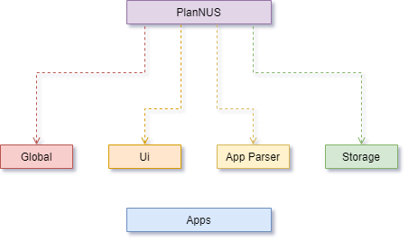

The ***Architecture Diagram*** given above explains the high-level design of PlanNUS. Below is a quick overview of each component.

[Back to Table of Contents](#1-table-of-contents)

 

### 3.2. Overview

#### 3.2.1. PlanNus

`PlanNus` class contains the `main` and `run` method, which is responsible for the following:

  * At launch

       * Loading all modules for AY2020/21 into PlanNUS

       * Loading previous save file into PlanNUS if available

       * Unified entry point to available apps in PlanNUS

  * While running

       * Continuously prompt user for app selection
       * Save after every change in `AcadPlan`

  * At shut down

       * Saving of user data into save file
       * Clean up methods where necessary

[Back to Table of Contents](#1-table-of-contents)

 

#### 3.2.2. Global, Ui, Parser, Storage, Apps

* The `global` package contains classes, exceptions and objects that are required across the whole app. 
* The `ui` package contains the class which is responsible for sharing one `scanner` class across the whole app to prevent multiple IO streams
* The `parser` package contains the class which handles user's app selection
* The `storage` package handles loading and saving of user's data to a save file.
* Packages for Available apps such as Academic Planner and CAP Calculator are stored within `apps` package

[Back to Table of Contents](#1-table-of-contents)

 

### 3.3. Project Structure

Each package in PlanNUS as given above follows the following file structure where applicable:

* A functional class which acts as the entry point to that module
* A parser class which parses user input into executable commands by PlanNUS

* `commands`: A package that handles all executable commands given by parser
* `commons`: A package with the utilities and shared classes across the parent package
* `exceptions`: A package to handle all exceptions thrown across the parent package

The interaction within each package should ideally be as shown below.

    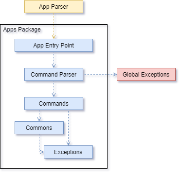

*Note that while this is the ideal case, packages such as* `global`, `parser` *and* `ui` *might not strictly follow this structure due to these package serving a different function altogether (Refer to the sections below for more details.)*

[Back to Table of Contents](#1-table-of-contents)

 

### 3.4. Life cycle of PlanNUS

The [*sequence diagram*](#sequence-diagram) below shows how different packages and classes interact with each other throughout the whole [life cycle](#life-cycle) of PlanNUS.

    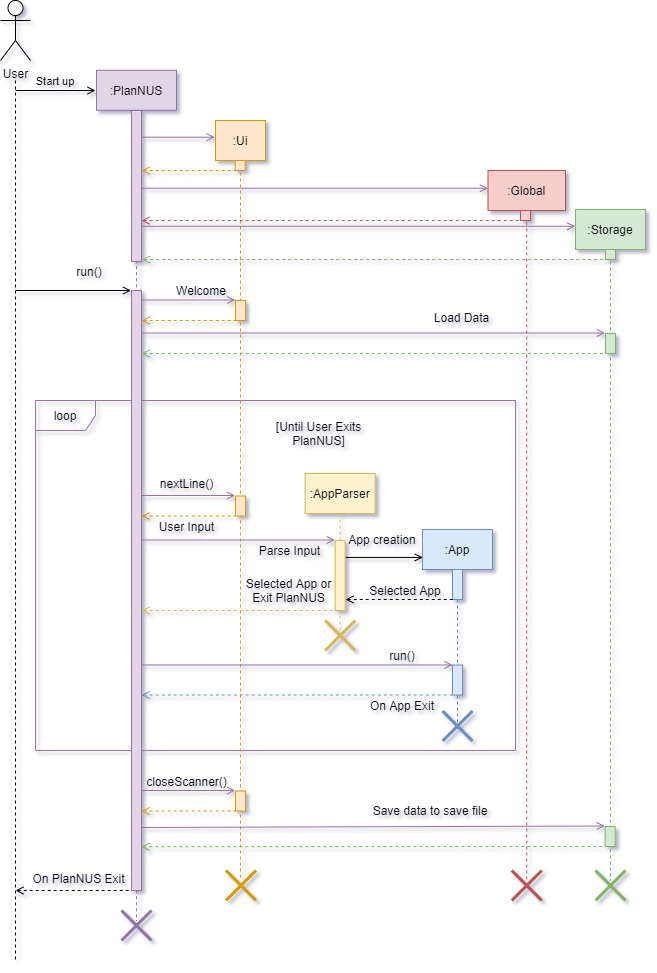

[Back to Table of Contents](#1-table-of-contents)

 

### 3.5. Details

    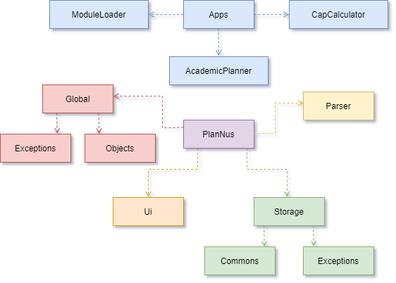

Note that the above diagram is only intended for showing the connections to PlanNus main class rather than between individual classes.

[Back to Table of Contents](#1-table-of-contents)

 

#### 3.5.1. Global Component

Note that the diagram below only shows the connections to `PlanNus` class. It does not show connections between individual classes.

    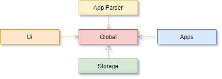

Classes used by multiple components are part of the `global` component of PlanNUS. This includes classes such as `App`,`Command` and `LoggingTool`. The main object classes `PartialModule`, `FullModule` and `Person` are also within the global component.

note that the diagram below only shows the connections to plannus main class. It does not show connections between individual classes

**API** : `src.main.java.seedu.duke.global`

[Back to Table of Contents](#1-table-of-contents)

 

#### 3.5.2. Storage Component

<!-- @@author harryleecp -->

    

The `Storage` component is responsible for the loading and saving of information from text files which can happen in two types of scenarios. The first type would be through the use of commands specified in the diagram which can be found in the _Academic Planner_ app. Alternatively, the user may also exit from the program using the commands within the application itself. This is to prevent loss of data when the user terminates the program by closing the command prompt or using the _ctrl-c_ command.

**API** : `src.main.java.seedu.duke.storage`

[Back to Table of Contents](#1-table-of-contents)

 

#### 3.5.3. Parser Component

<!-- @@author JuZihao -->

    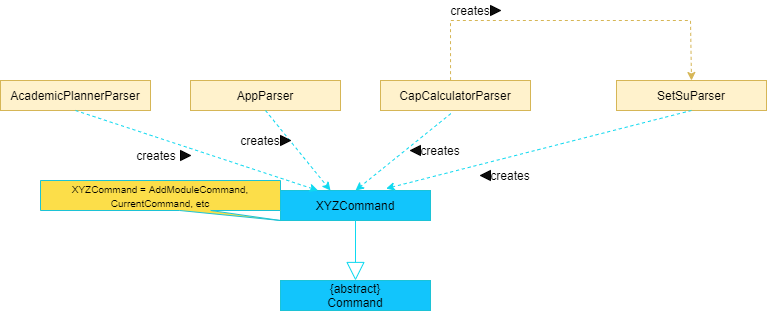

For the architecture of PlanNUS, the `Parser` classes will belong under the application they will be parsing for. The role 
of these parsers is to process the user's input and return the appropriate command with required parameters to initialise the command. The newly created objects will then be returned to the main command to be executed and thereafter, terminated. 

**API** : `src.main.java.seedu.duke.parser.AppParser`, `src.main.java.seedu.duke.apps.academicplanner.AcademicPlannerParser`, `src.main.java.seedu.duke.apps.capcalculator.CapCalculatorParser` and `src.main.java.seedu.duke.apps.capcalculator.SetSuParser`

[Back to Table of Contents](#1-table-of-contents)

 

#### 3.5.4. Ui Component

<!-- @@author jerroldlam -->

    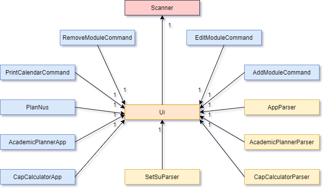

Note: XYZ stand for any class. For example, `XYZParser` refers to `AppParser`,`AcademicPlannerParser` etc.

In PlanNUS, the `Ui` component is integral in initialising a `Scanner` class and passing it to methods where they require them. `Ui` also provides functions to output formatted lines to console to improve readability for the user.

**API** : `src.main.java.seedu.duke.ui.Ui`

[Back to Table of Contents](#1-table-of-contents)

 

## 4. Implementation

### 4.1. Academic Calendar Planner: Add Module feature

#### 4.1.1. Current implementation

Add module command is executed by `AcademicPlannerParser`. It allows users to add modules into their Academic Planner by instantiating a new `PartialModule` object and adding it into the `userModuleList` and `userModuleMap`. Both the list and hashmap are the _java API_, which are used by importing them. The `Person` object is used to encapsulate both `userModuleList` and `userModuleMap`.

Additionally, the add module command extends the `Command` class and overrides its `execute()` command. An external class, `ModuleValidator` is called upon to validate the various parameters that the user has entered, as to only allow valid modules to be added to the user.

Given below is an example usage scenario and how add module command behaves at each step.

    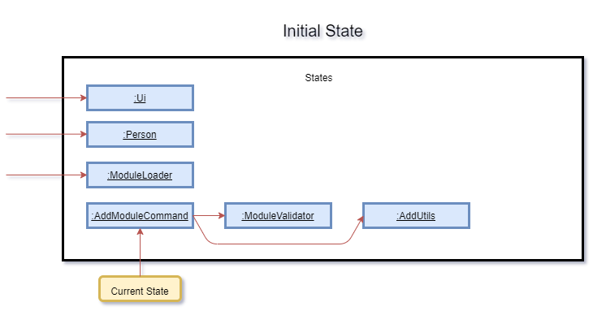

__Step 1__ : The user calls the add module command from the `AcademicPlannerParser`, which will initialise a 
`AddModuleCommand`. `AddModuleCommand`'s constructor takes in parameters of `ModuleLoader`, `Person`,`Ui`, 
and `String`. Below is a table of what each parameter corresponds to in the state diagram of the program.

|Parameter (Class Name)|Corresponds to (Function of Class)|Referred to as (Variable Name)|
|:---:|:---:|:---:|
|`ModuleLoader`| Class representing all modules offered by NUS | `allModules` |
|`Person`| Class representing current user's information | `currentPerson`|
|`Ui`| Class encapsulating java's default scanner class | `in`|
|`String` | Class representing the module code to be added | `moduleCode`|

    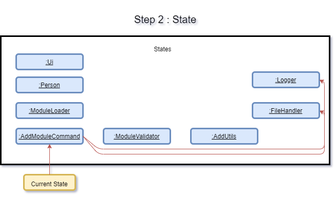

__Step 2__ : `execute()` is called from the instance of `AddModuleCommand`. It can throw `AcademicException` 
or `IOException`. `FileHandler` and `Logger` classes from the _java API_ are instantiated to handle logging for the remainder of the `execute()` method. 

__Step 3__ : `in` then reads in the next line of input, which is the user's input for the desired semester for the `moduleCode`. This is then validated against `allModules`, while accounting for `isRetake` variable. `isRetake` is a flag variable which indicates that
the module newly entered by the user is a module that is going to be retaken.

__Step 4__ : The next line of input is read from `in`, which is the user's input for grade value, which is also validated by `ModuleValidator`.

__Step 5__ : `AddUtils` is called upon to return module credit for `moduleCode` by `getModuleCreditForModule()`.

    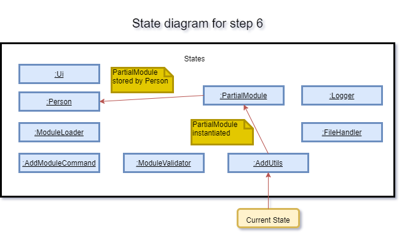

__Step 6__ :  `AddUtils` is called upon again to add the module's data to the user, by instantiating a new
`PartialModule` and storing it in both `userModuleList` and `userModuleMap` via `Person`.

    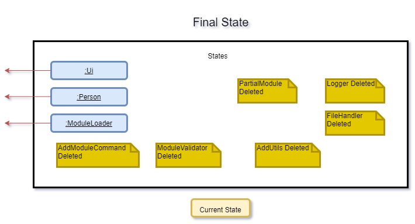

__Step 7__ : `FileHandler`, `Logger`, `ModuleValidator`, `AddUtils` and `AddModuleCommand` are terminated. `PartialModule` is not terminated as it is now referenced by `userModuleList` and `userModuleMap` in `Person`.

The following sequence diagram shows how the `AddModuleCommand` works:

    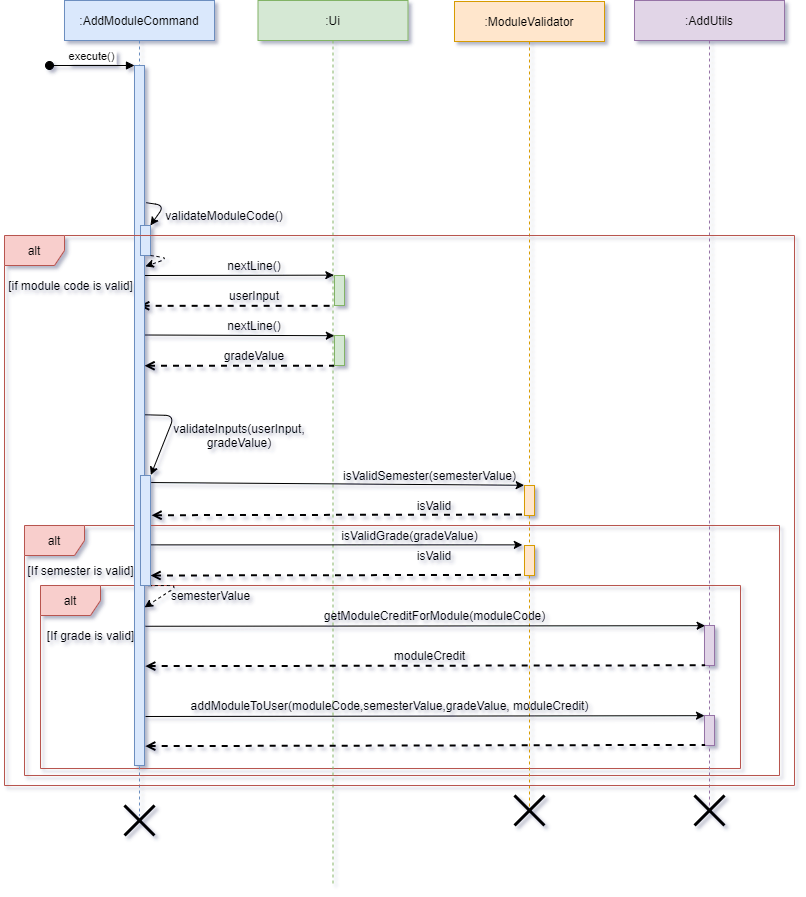

The following activity diagram summarizes what happens when the user executes a `AddModuleCommand` :

    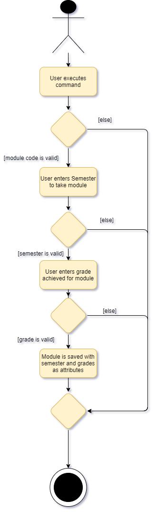

#### 4.1.2. Design considerations

The following options were considered when implementing commands:

* Option 1 (Current Implementation): Implementing each command as a class by itself
    * Pros: Increases modularity of code, higher overall code quality 
    * Cons: More complicated to implement
* Option 2: Implementing each command as a method in a class
    * Pros: Easier to implement
    * Cons: Class needs to be instantiated and increases coupling, reducing testability. This method also decreases SLAP.

[Back to Table of Contents](#1-table-of-contents)

 

### 4.2. Academic Calendar Planner: Edit Module Feature

<!-- @@author harryleecp -->

#### 4.2.1. Current implementation

Similar to the add module command, the edit module command is also executed by `AcademicPlannerParser`. It allows the user to edit the existing modules added to their `Academic Planner` by accessing the specified `PartialModule` object within the `userModuleList`and `userModuleMap`. 

Given below is an example usage scenario and how edit module command behaves at each step.

    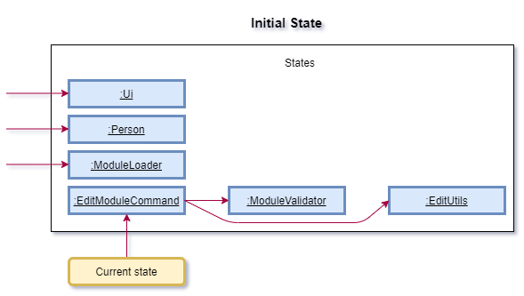

__Step 1:__ The user calls the edit module command from the `AcademicPlannerParser` and  then `EditModuleCommand` will be initialized where its constructor would take in the same parameters as that of `AddModuleCommand`.

__Step 2:__ The `execute()` method is called from the instance of `EditModuleCommand` which only throws `AcademicException` if applicable.

__Step 3:__ Method `isModTakenByUser()` of the `ModuleValidator` is called to check if the `moduleCode` entered by the user exists within the `userModuleList` and `userModuleMap`.

__Step 4:__ If there are multiple occurrences of the specified `moduleCode` which are retaken, the user will be prompted to select the desired index of the module to be modified. 

__Step 5:__ `in` reads the next line of input for user's choice of modifying either the semester or grade of the selected `moduleCode`.

__Step 6:__ `isValidSemester()` or `isValidGrade()` is called to validate the semester or grade entered by the user.

__Step 7:__ `updateModuleSemester()` or `updateModuleGrade()` is then called to conduct necessary changes to the information by accessing the module from `userModuleMap` and `userModuleList`.

    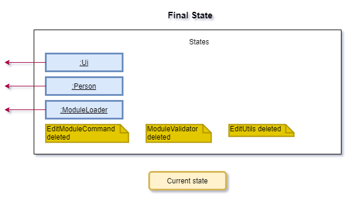

__Step 8:__ `EditModuleCommand`, `EditUtils` and `ModuleValidator` are terminated.

The following sequence diagram shows how `EditModuleCommand` works.

    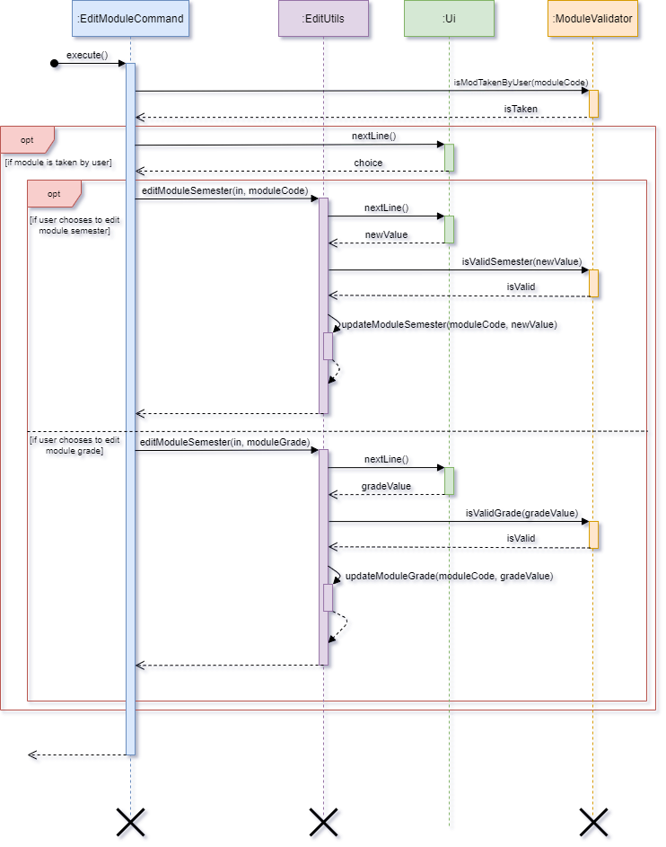

The following diagram summarizes what happens when the user executes a `EditModuleCommand`: 

    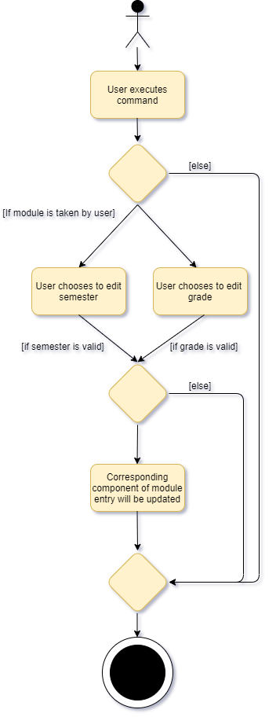

[Back to Table of Contents](#1-table-of-contents)

 

### 4.3. Academic Calendar Planner: Remove Module Feature

#### 4.3.1. Current implementation

The remove module command is executed by `AcademicPlannerParser` just like the commands for add and edit. This feature allows the user to delete any existing modules added to their Academic Planner.  by first accessing the specified `PartialModule` object within the `userModuleList`and `userModuleMap`.

Given below is an example usage scenario and how remove module command behaves at each step.

    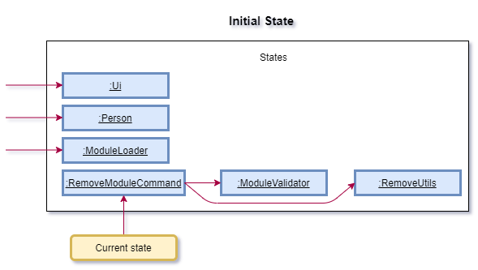

__Step 1:__ The user calls the remove module command from the `AcademicPlannerParser` and  then `RemoveModuleCommand` will be initialized where its constructor would take in the same parameters as that of `AddModuleCommand` and `EditModuleCommand`.

__Step 2:__ The `execute()` method is called from the instance of `RemoveModuleCommand` which only throws `AcademicException` if applicable.

__Step 3:__ Method `isModTakenByUser()` of the `ModuleValidator` is called to check if the `moduleCode` entered by the user exists within the `userModuleList` and `userModuleMap`.

__Step 4:__ `removeModuleFromUserModuleList()` of `removeUtils` is then called to delete the specified `moduleCode`.

__Step 5:__ The`depopulate()` method deletes the module object by accessing it from `userModuleMap` and `userModuleList` before updating the both the hashmap and the array list.

    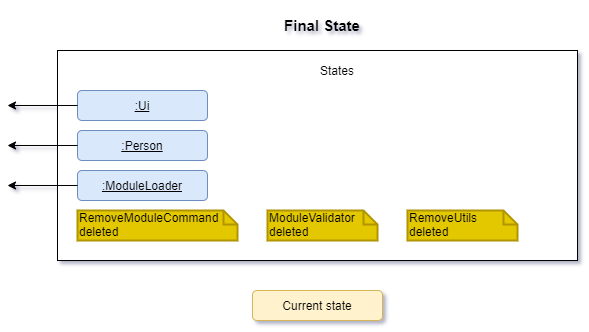

__Step 6:__ `RemoveModuleCommand`, `RemoveUtils` and `ModuleValidator` are terminated.

The following sequence diagram shows how `RemoveModuleCommand` works.

    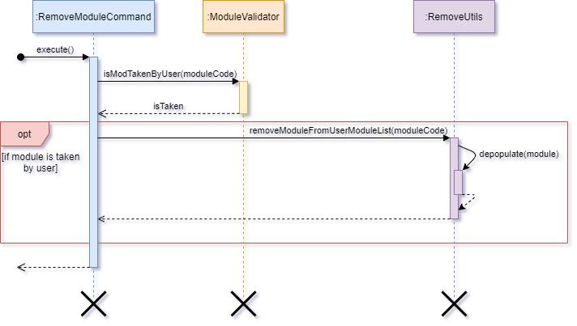

The following diagram summarizes what happens when the user executes a `RemoveModuleCommand`: 

    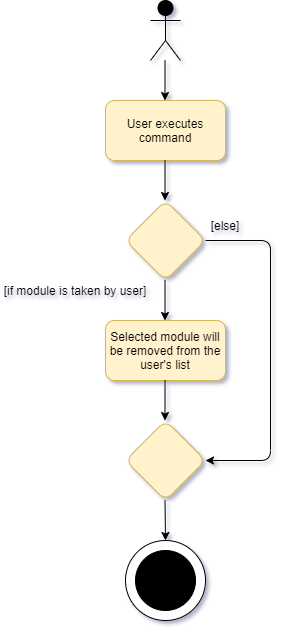

[Back to Table of Contents](#1-table-of-contents)

 

### 4.4. Academic Calendar Planner: View Module Details Feature

<!-- @@author vanessa-kang -->

#### 4.4.1. Current implementation

View module details command is executed by `AcademicPlannerParser`. It allows the user to view the full details of any module offered by NUS, by accessing the specified `FullModule` object that corresponds to the module code entered by the user, and printing its attributes.

Additionally, the view module details command extends the `Command` class and overrides its `execute()` command. An external class, `ModuleValidator` is called upon to validate the module code that the user has entered, as only the details of valid NUS modules can be displayed.

Given below is an example usage scenario and how view module command behaves at each step.

    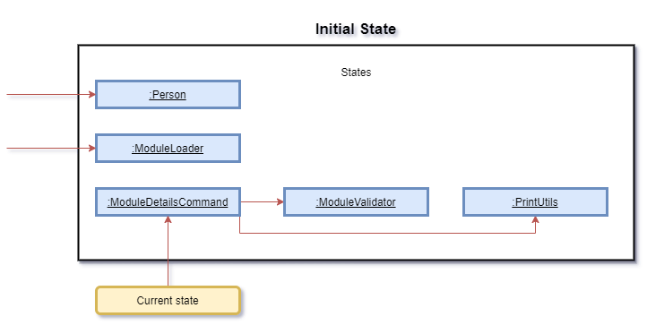

__Step 1:__ The user calls the view module details command from the `AcademicPlannerParser`, which will initialise a `ModuleDetailsCommand`. `ModuleDetailsCommand`'s constructor takes in parameters of  `ModuleLoader` and `String`. Below is a table of what each parameter corresponds to in the state diagram of the program.

| Parameter (Class Name) |        Corresponds to (Function of Class)         | Referred to as (Variable Name) |
| :-------------------------: | :----------------------------------------------------: | :---------------------------------: |
|       `ModuleLoader`        |     Class representing all modules offered by NUS      |            `allModules`             |
|          `String`           | Class representing the module code to print details of |            `moduleCode`             |

__Step 2:__ `execute()` is called from the instance of `ModuleDetailsCommand`. It can throw `AcademicException`.

__Step 3:__ `validateModuleCode()` is called to validate the user input, `moduleCode`, against `allModules`.

__Step 4:__ `PrintUtils` is called to print the details of the module.

    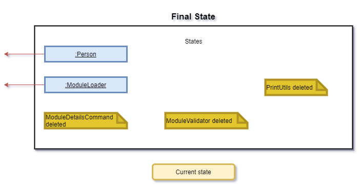

__Step 5:__ `ModuleDetailsCommand`, `ModuleLoader` and `PrintUtils` are terminated.

The following sequence diagram shows how `ModuleDetailsCommand` works.

    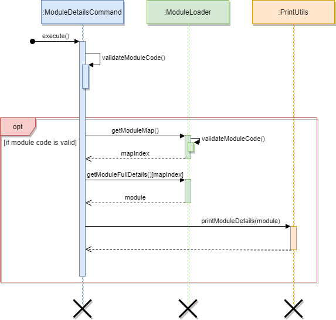

The following diagram summarizes what happens when the user executes a `ModuleDetailsCommand`: 

    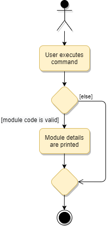

[Back to Table of Contents](#1-table-of-contents)

 

<!-- @@author JuZihao -->
### 4.5. CAP Calculator feature : Show current results feature

#### 4.5.1. Current implementation

`CurrentCommand` is executed by `CapCalculatorApp`. It displays user's current CAP, graded MCs and total MCs. These parameters depend on the modules added in `AcademicPlannerApp` and is retrieved from  the `Person` object. These data are obtained by calling the methods `getCurrentTotalMcxGrade()`, `getCurrentMcAfterSU()` and `getCurrentMc()`.

Given below is an example usage scenario and how edit module command behaves at each step.

__Step 1:__ The user calls the `CurrentCommand` from the `CapCalculatorParser` and the parameter `currentPerson` will be parsed into `CurrentCommand` and a new instance of `CurrentCommand` is created.

__Step 2:__ The `execute()` method is called from the instance of `CurrentCommand`.

__Step 3:__ The `getCurrentCap()` method is then called to get the current CAP of user.

__Step 4:__  The methods `displayCurrentCap()`, `displayCurrentMcAfterSU()` and `displayCurrentMc()` is then called to display the corresponding results to user.

__Step 5:__  `CurrentCommmand` is then terminated.

The following sequence diagram shows how `CurrentCommand` works.

    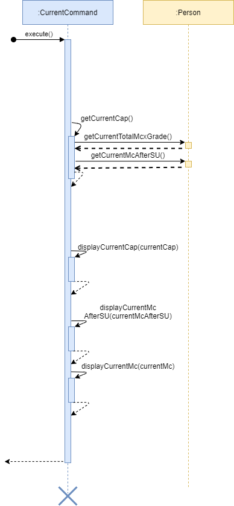

[Back to Table of Contents](#1-table-of-contents)

### 4.6. CAP Calculator feature : Set S/U by semester feature

#### 4.6.1. Current implementation

`SetSuBySemesterCommand` is executed by `CapCalculatorApp`. It provides users with a suggestion on how they can S/U their modules added in `AcademicPlannerApp` by retrieving the `userModuleList` from  the `Person` object and filter the list according to the semester provided to get a `suList`.

`suList` will then be analysed to provide user with a list of suggested S/U modules to achieve the best CAP.

 Given below is an example usage scenario and how `SetSuBySemesterCommand` behaves at each step.

    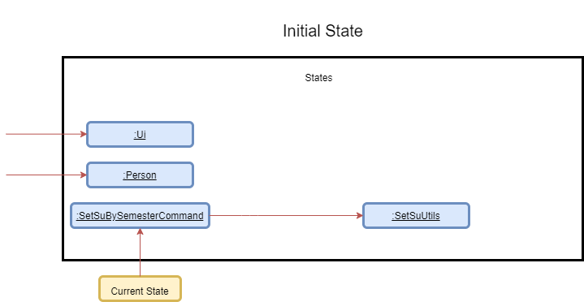

    

__Step 1:__ The user calls the set S/U command from the `CapCalculatorParser` and the parameters `choice`, `currentPerson` and `ui` will be parsed into `SetSuParser`. 

__Step 2:__ Depending on the parameter `choice`, `SetSuParser` decides either `SetSuBySemesterCommand` or `SetSuByModulesCommand` to be parsed into `CapCalculatorApp`. Taking that the user decides to parse the `SetSuBySemesterCommand` by entering _1_.

__Step 3:__ The `execute()` method is called from the instance of `SetSuBySemesterCommand` which only throws `CapCalculatorException` if applicable.

__Step 4:__ `SetSuUtils` is created and the method `promptUserForSemester()` of `SetSuUtils` is called to read the next line of input for user's choice of a semester to S/U.

__Step 5:__  The method `getSuListBySemester()` of `SetSuUtils` is then called to get a list of valid modules that the user can S/U.

    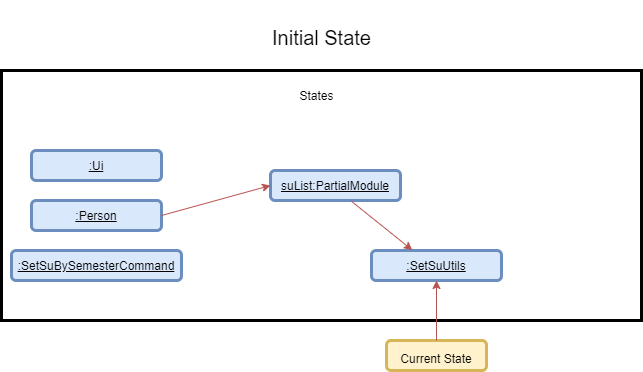

    

__Step 6:__  The method `showResultsToUser()` of `SetSuUtils` is then called to display the suggestions to user.

__Step 7:__  `SetSuBySemesterCommmand` and `SetSuUltils` are terminated.

    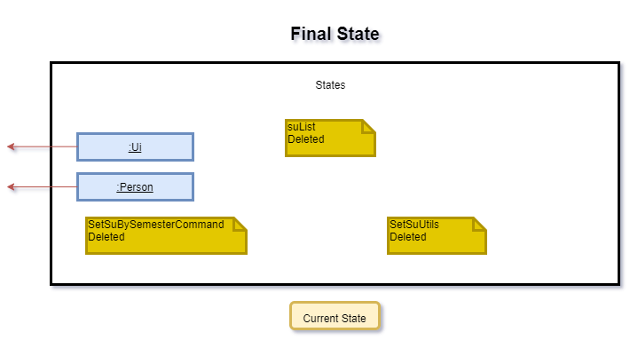

    

The following sequence diagram shows how `SetSuBySemesterCommand` works.

    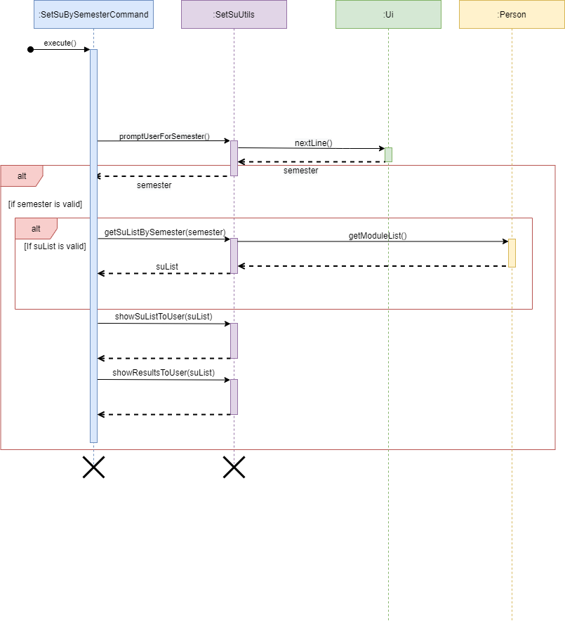

The following diagram summarizes what happens when the user executes a `SetSuBySemesterCommand`: 

    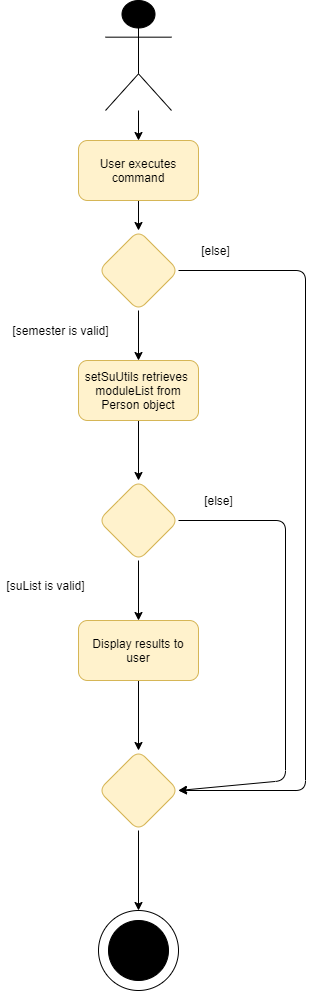

    

[Back to Table of Contents](#1-table-of-contents)

 

<!-- @@author -->

## 5. Useful Links

* [**About Us**](https://ay2021s1-cs2113t-f12-1.github.io/tp/AboutUs.html)
* [**Configuration guide**](https://ay2021s1-cs2113t-f12-1.github.io/tp/ConfigurationGuide.html)
* [**DevOps guide**](https://ay2021s1-cs2113t-f12-1.github.io/tp/DevOpsGuide.html)
* [**Documentation guide**](https://ay2021s1-cs2113t-f12-1.github.io/tp/DocumentationGuide.html)
* [**Logging guide**](https://ay2021s1-cs2113t-f12-1.github.io/tp/LoggingGuide.html)
* [**Testing guide**](https://ay2021s1-cs2113t-f12-1.github.io/tp/TestingGuide.html)
* [**User guide**](https://ay2021s1-cs2113t-f12-1.github.io/tp/UserGuide.html)

[Back to Table of Contents](#1-table-of-contents)

 

## 6. Appendix: Requirements

### 6.1. Product scope

__Target user profile:__

* has adequate level of familiarization with CLI applications
* requires a clear outlook of academic journey with the modules offered by NUS
* wants to keep track of his or her results and set target grades for the upcoming semester(s)
* prefers using desktop or laptop instead of other electronic devices

__Value proposition:__
Provides NUS undergraduates with a platform to keep track of their academic progress and explore other possibilities with the plethora of modules available. In addition, provides NUS undergraduates with an avenue to have an automatic calculation
of their scores and receive information regarding the use of their Satisfactory / Unsatisfactory options. 

[Back to Table of Contents](#1-table-of-contents)

 

### 6.2. User stories

| Version | As a ...                                                  | I want to ...                                                             | So that I can ...                                                                     |
| :-----: | --------------------------------------------------------- | ------------------------------------------------------------------------- | ------------------------------------------------------------------------------------- |
| v1.0    | fresh undergraduate                                       | visualize the modules in the recommended schedule and course requirements | better plan out my academic journey for the next 4-5 years in NUS                     |
| v1.0    | undergraduate with at least 1 semester of study completed | calculate my CAP easily                                                   | forecast my own expected graduation CAP and if they match my expected CAP             |
| v1.0    | undergraduate with at least 1 semester of study completed | print out a personalized list of modules taken so far and grades obtained | track my academic progression in NUS                                                  |
| v2.0    | user of PlanNUS                                           | find modules I have completed in a particular semester                    | view specific information I require about that semester without redundant information |
| V2.0    | user of PlanNUS                                           | easily access my last made list                                           | save time on retyping my academic calendar after each use                             |
| V2.0    | user of PlanNUS                                           | view module details                                                       | make an informed decision on which modules to take up during the semester             |
| V2.0    | user of PlanNUS                                           | search modules by their partial keys                                      | view more modules with similar subject codes                                          |
| V2.0    | undergraduate with at least 1 semester of study completed | have suggestions on which modules to mark as S/U                          | make an informed decision on which modules to S/U                                     |

[Back to Table of Contents](#1-table-of-contents)

 

### 6.3. Use cases

<!-- @@author vanessa-kang -->

 

__Use case 1: Add a module to academic calendar__

**Preconditions: User is in the Academic Planner app.**

__MSS__ 

1. User chooses to add a module to their academic calendar.

2. PlanNUS prompts user to enter semeseter that they plan to take the module.

3. User enters semester that they plan to take the module.

4. PlanNUS prompts user to enter grade received for the module.

5. User enters grade received for the module.

6. PlanNUS adds the module to the user's academic calendar, and displays a confirmation message

   Use case ends.

__Extensions__

- 1a. User did not specify a module code while adding a module.

  - 1a1. PlanNUS shows a _missing parameter_ error message.
    
  
  Use case ends.
  
- 1b. User enters a module code that is not offered by NUS.

  - 1b1. PlanNUS shows an _invalid module code_ error message.
    
  
  Use case ends.
  
- 3a. User enters an invalid semester.
  
  - 3a1. PlanNUS shows an _invalid semester_ error message.
  
    Use case ends.
  
- 5a. User enters an invalid grade.
  
  - 5a1. PlanNUS shows an _invalid grade_ error message.
    
    Use case ends.

 

**Use case 2: Edit a module in academic calendar**

**Preconditions: User is in the Academic Planner app.**

__MSS__ 

1. User chooses to edit a module currently in their academic calendar.

2. PlanNUS prompts user to indicate the feature (semester/grade) that they would like to edit.

3. User chooses feature to edit.

4. PlanNUS prompts user to enter updated value for chosen feature.

5. User enters updated value.

6. PlanNUS edits the value accordingly, stores the updated value in the user's academic calendar, and displays a confirmation message.

Use case ends.

__Extensions__

- 1a. User did not specify a module code while editing a module.

  - 1a1. PlanNUS shows a _missing parameter_ error message.
    
  
  Use case ends.
  
- 1b. User enters a module code that is not offered by NUS.
  
  - 1b1.  PlanNUS shows an _invalid module code_ error message.
    
    Use case ends.
  
- 1c. User enters a module code that is offered by NUS, but is not currently in the user's academic calendar.
  
  - 1c1. PlanNUS shows a _module not in calendar_ error message.
    
    Use case ends.
  
- 3a. User chooses a feature that is invalid.
  
  - 3a1. PlanNUS shows an _invalid feature_ error message.
    
    Use case ends.
  
- 5a. User enters an updated value that is invalid.
  
  - 5a1. PlanNUS shows an _invalid value_ error message.
    
    Use case ends.

 

**Use case 3: Remove a module from academic calendar**

**Preconditions: User is in the Academic Planner app.**

__MSS__ 

1. User chooses to remove a module currently in his or her academic calendar.

2. PlanNUS removes the corresponding module from the user's academic calendar, and displays a confirmation message.

   Use case ends.

__Extensions__

- 1a. User did not specify a module code while removing a module.
  - 1a1. PlanNUS shows a _missing parameter_ error message.
    
  
  Use case ends.
  
- 1b. User enters a module code that is not offered by NUS.
  
  - 1b1.  PlanNUS shows an _invalid module code_ error message.
    
    Use case ends.
  
- 1c. User enters a module code that is offered by NUS, but is not currently in the user's academic calendar.
  
  - 1c1. PlanNUS shows a _module not in calendar_ error message.
    
    Use case ends.

 

**Use case 4: View details of a module**

**Preconditions: User is in the Academic Planner app.**

__MSS__

1. User chooses to view details of a module.

2. PlanNUS prints the details of the corresponding module.

   Use case ends.

__Extensions__

- 1a. User did not specify a module code while viewing details of a module.
  - 1a1. PlanNUS shows a _missing parameter_ error message.
    
    Use case ends.

- 1b. User enters a module code that is not offered by NUS.
  - 1b1.  PlanNUS shows an _invalid module code_ error message.
    
    Use case ends.

 

**Use case 5: Search for a module**

**Preconditions: User is in the Academic Planner app.**

__MSS__

1. User searches for a module, based on the module code.

2. PlanNUS displays the search results, up to and including the first 10 results.

   Use case ends.

__Extensions__

- 1a. User did not specify a module code while searching for a module.
  - 1a1. PlanNUS shows a _missing parameter_ error message.
    
    Use case ends.

 

**Use case 6: View academic calendar**

**Preconditions: User is in the Academic Planner app.**

__MSS__

1. User chooses to view his or her current academic calendar.

2. PlanNUS prompts user to indicate his or her desired viewing timeframe, i.e. 

   a) the full academic calendar, or 

   b) view a particular semester only.

3. User specifies their desired timeframe.

4. PlanNUS displays the academic calendar accordingly.

   Use case ends.

__Extensions__

- 1a. User's academic calendar is currently empty.

  - 1a1. PlanNUS shows an _empty calendar_ error message.
    
    Use case ends.
- 3a. User did not specify a valid timeframe.

  - 3a1. PlanNUS shows an _invalid timeframe_ error message.
    
    Use case ends.
- 3b. User specifies a valid semester, but there are no modules added to that semester yet.

  - 3b1. PlanNUS shows an _empty semester_ error message.
    
    Use case ends.

 

**Use case 7: View list of available commands**

**Preconditions: User is in the Academic Planner app or CAP Calculator app.**

__MSS__

1. User chooses to view the list of available commands in the Academic Planner app.

2. PlanNUS displays the list of available commands.

 

**Use case 8: Exit back to PlanNUS**

**Preconditions: User is in the Academic Planner app or CAP Calculator app.**

__MSS__

1. User chooses to exit from the Academic Planner app back to the PlanNUS main menu.

2. PlanNUS exits back to the PlanNUS main menu.

 

<!-- @@author JuZihao -->
**Use case 9: View current results in CAP Calculator**

**Preconditions: User is in the CAP Calculator app.**

__MSS__ 

1. User chooses to view his or her current results.

2. PlanNUS displays user's current results.

Use case ends.

 

**Use case 10: Set target CAP in CAP Calculator**

**Preconditions: User is in the CAP Calculator app.**

__MSS__ 

1. User chooses to set a target in CAP Calculator.

2. PlanNUS prompts user for a target CAP.

3. User enters a target CAP.

4. PlanNus prompts user for number of graded MCs to achieve that target CAP.

5. User enters a target graded MCs.

6. PlanNus displays user with the results needed to achieve the target CAP.

Use case ends.

__Extensions__

- 3a. User did not enter a valid target CAP.
  - 3a1. PlanNUS shows an _invalid CAP_ error message.
    
    Use case ends.
  
- 5a. User provides a valid target CAP, but the target MCs is not valid.
  - 5a1. PlanNUS shows an _invalid MCs_ error message.
    
    Use case ends.

 

**Use case 11a: Set S/U by semester in CAP Calculator**

**Preconditions: User is in the CAP Calculator app.**

__MSS__ 

1. User chooses to set S/U in CAP Calculator.

2. PlanNUS prompts user for his or her desired set S/U method.

    a) Set S/U by semester, or
    
    b) Set S/U by modules

3. User enters to set S/U by semester.

4. PlanNus prompts user for the semester that he or she wishes to S/U.

5. PlanNus displays user with the the best CAP possible and the modules.

Use case ends.

__Extensions__

- 3a. User did not enter a valid semester.

  - 3a1. PlanNUS shows an _invalid semester_ error message.
    
    Use case ends.

 

**Use case 11b: Set S/U by modules in CAP Calculator**

**Preconditions: User is in the CAP Calculator app.**

__MSS__ 

1. User chooses to set S/U in CAP Calculator.

2. PlanNUS prompts user for his or her desired set S/U method.

    a) Set S/U by semester, or
    
    b) Set S/U by modules

3. User enters to set S/U by modules.

4. PlanNus prompts user for number of modules that he or she wishes to S/U.

5. PlanNus prompts user for the module codes that he or she wishes to S/U.

6. User enters to the module codes.

7. PlanNus displays user with the the best CAP possible and the modules.

Use case ends.

__Extensions__

- 3a. User did not enter an integer.

  - 3a1. PlanNUS shows an _invalid number_ error message.
  
- 3b. User enters a number that is too large.

  - 3b1. PlanNUS shows a _number out of bound_ error message.

    Use case ends.
  
- 5a. User did not enter a valid module code.

  - 5a1. PlanNUS shows an _invalid module_ error message.
  
- 5b. User enters a duplicated module code.

  - 5b1. PlanNUS shows a _duplicate module_ error message.

    Use case ends.

[Back to Table of Contents](#1-table-of-contents)

 

### 6.4. Non-Functional Requirements

<!-- @@author jerroldlam -->

* General
    * Should work on any [mainstream OS](#mainstream-os) as long as it has Java `11` or above installed.
    * Commands entered should be short and intuitive to reduce mistyping of commands
    * Program should be compatible on a wide range of devices
* Academic Planner
    * Viewing of Academic Calendar should be intuitive as a complicated or messy output compromises usability of PlanNUS
    * Only verified modules offered by NUS should be able to be added to prevent confusion
    * The navigation between applications should be intuitive
* CAP Calculator
    * Data should be shared between applications in order to reduce redundant typing from the user

[Back to Table of Contents](#1-table-of-contents)

 

### 6.5. Glossary

<!-- @@author JuZihao -->

#### Mainstream OS
Windows, Linux, Unix, OS-X

#### Life cycle
The duration in which the object is running and alive.

#### Sequence Diagram
A UML diagram that captures the interactions between multiple objects for a given scenario.

[Back to Table of Contents](#1-table-of-contents)

 

<!-- @@author -->

## 7. Features Coming Soon (V3.0 and beyond)

* Support max limit for the `Set SU` function in `capcalc`
* Support discontinued modules from NUS
* Support shortened commands for parsers
* Support validation of requirements for modules

[Back to Table of Contents](#1-table-of-contents)

 

## 8. Appendix: Instructions for manual testing

<!-- @@author vanessa-kang -->

 

Given below are instructions to test the app manually.

ℹ️ **Note:** These instructions only provide a starting point for testers to work on; testers are expected to do more *exploratory* testing.

 

**Launch and shutdown**

1. Initial launch

   1. Download the jar file and copy it into an empty folder.

   2. Open a command prompt and navigate to the folder.

   3.  Enter `java -jar PlanNus.jar` and press enter to launch the app.
       
       Expected: The PlanNUS main menu is displayed, and the save file is loaded. If a save file does not exist, a new one is created.

2. Shutdown
   1. Test case: `exit`
      
      Expected: PlanNUS saves data from the current session, prints a goodbye message, and exits the software entirely.

 

**Entering and exiting apps**

1. Entering apps from the main menu

   1. Test case - entering the _Academic Planner_ app.

      Input: `acadplan` or `a`

      Expected: PlanNUS enters the _Academic Planner_ app.

   2. Test case - entering the _CAP Calculator_ app.

      Input: `capcalc` or `c`

      Expected: PlanNUS enters the _CAP Calculator_ app.

2. Switching between apps

   1. Test case - switching to the _CAP Calculator_ app while in the _Academic Planner_ app.

      Input: `capcalc`

      Expected: PlanNUS enters the _CAP Calculator_ app.

   2. Test case - Switching to the _Academic Planner_ app while in the _CAP Calculator_ app.

      Input: `acadplan`

      Expected: PlanNUS enters the _Academic Planner_ app.

3. Exiting to the main menu from within an app.

   1. Test case - exiting to the main menu.

      Input: `exit`

      Expected: PlanNUS exits to the main menu.

 

**Adding a module to the academic calendar**

1. Prerequisites: User is currently in the _Academic Planner_ app.

2. Test case - all inputs are valid.

   Input: `add cs2113t`

   Expected: PlanNUS prompts user to enter semester that they plan to take the module.

   Input: `1`

   Expected: PlanNUS prompts user to enter grade received for the module.

   Input: `NT`

   Expected: PlanNUS adds the module, with the associated semester and grade information, to the user's academic calendar. Prints a _module added_ confirmation message.

3. Test case - invalid module code.

   Input: `add cs1111`

   Expected: PlanNUS shows a _module not offered by NUS_ error message, and exits back to the _Academic Planner_ app.

4. Other incorrect inputs to try: no module code, invalid semester indexes, invalid grades.

   Expected: PlanNUS shows an error message, and exits back to the _Academic Planner_ app. No module is added to the user's academic calendar.

 

**Editing a module currently in the academic calendar**

1. Prerequisites: User is currently in the _Academic Planner_ app, and the module being edited is currently in their academic calendar.

2. Test case - all inputs are valid. Feature being edited is semester.

   Input: `edit cs2113t`

   Expected: PlanNUS prompts user to enter number corresponding to feature to be edited.

   (1 - semester, 2 - grade).

   Input: `1`

   Expected: PlanNUS prompts user to enter new semester value.

   Input: `3`

   Expected: PlanNUS edits semester accordingly, and prints a _update successful_ confirmation message.

3. Test case - all inputs are valid. Feature being edited is grade.

   Input: `edit cs2113t`

   Expected: PlanNUS prompts user to enter number corresponding to feature to be edited.

   (1 - semester, 2 - grade).

   Input: `2`

   Expected: PlanNUS prompts user to enter new grade.

   Input: `A+`

   Expected: PlanNUS edits grade accordingly, and prints a _update successful_ confirmation message.

4. Other incorrect inputs to try: no module code, invalid module codes, valid module codes that are not in the user's academic calendar, invalid features, invalid semester indexes, invalid grades.

   Expected: PlanNUS shows an error message, and exits back to the _Academic Planner_ app. No module features are edited.

 

**Removing a module from the academic calendar**

1. Prerequisites: User is currently in the _Academic Planner_ app, and the module being removed is currently in their academic calendar.

2. Test case - all inputs are valid.

   Input: `remove cs2113t`

   Expected: PlanNUS removes module from user's academic calendar, and prints a _remove successful_ confirmation message.

3. Other incorrect inputs to try: no module code, invalid module codes, valid module codes that are not in the user's academic calendar.

   Expected: PlanNUS shows an error message, and exits back to the _Academic Planner_ app. No module is removed from the user's academic calendar.

 

**Viewing the details of a module**

1. Prerequisites: User is currently in the _Academic Planner_ app.

2. Test case - all inputs are valid.

   Input: `details cs2101`

   Expected: PlanNUS prints the details of the corresponding module.

3. Other incorrect inputs to try: no module code, invalid module codes.

   Expected: PlanNUS shows an error message, and exits back to the _Academic Planner_ app. No module details are printed.

 

**Searching for modules that contain a keyword**

1. Prerequisites: User is currently in the _Academic Planner_ app.

2. Test case - all inputs are valid.

   Input: `search cs21`

   Expected: PlanNUS prints the modules that contain the keyword, up to the first 10 results.

3. Other incorrect inputs to try: no search key.

   Expected: PlanNUS shows an error message, and exits back to the _Academic Planner_ app. No search results are printed.

 

**Viewing the academic calendar**

1. Prerequisites: User is currently in the _Academic Planner_ app, and their academic calendar is currently not empty.

2. Test case - all inputs are valid.

   Input: `view`

   Expected: PlanNUS prompts user to choose a viewing timeframe.

   (`full` - full academic calendar, `1-10` - specific semester)

   Input: `full`

   Expected: PlanNUS prints the user's full academic calendar.

3. Other incorrect inputs to try: `view` when the academic calendar is empty, invalid viewing timeframe chosen. 

   Expected: PlanNUS shows an error message, and exits back to the _Academic Planner_ app. No academic planner is printed.

 

**Viewing current CAP**

1. Prerequisites: User is currently in the _CAP Calculator_ app.

2. Test case - all inputs are valid.

   Input: `current`

   Expected: PlanNUS prints the user's current CAP, total graded MCs and total MCs taken.

 

**Setting a target CAP**

1. Prerequisites: User is currently in the _CAP Calculator_ app.

2. Test case - all inputs are valid.

   Input: `set target`

   Expected: PlanNUS prompts user to enter their target CAP.

   Input: `4.3`

   Expected: PlanNUS prompts user to enter the number of graded MCs they are taking to achieve the target cap.

   Input: `50`

   Expected: PlanNUS prints the minimum CAP required in order to achieve the target CAP.

3. Other incorrect inputs to try: target CAP not within `0.00-5.00` inclusive, number of graded MCs not within `1-180` inclusive.

   Expected: PlanNUS shows an error message, and exits back to the _CAP Calculator_ app. No CAP advice is printed.

 

**Setting SU**

1. Prerequisites: User is currently in the _CAP Calculator_ app, and their academic calendar is currently not empty.

2. Test case - all inputs are valid. Set S/U by semester.

   Input: `set su`

   Expected: PlanNUS prompts user to enter number corresponding to S/U method

   (1 - semester, 2 - modules)

   Input: `1`

   Expected: PlanNUS prompts user to enter semester that they wish to S/U.

   Input: `1`

   Expected: PlanNUS prints the current S/U list, possible S/U scenarios, and S/U advice.

3. Test case - all inputs are valid. Set S/U by modules.

   Input: `set su`

   Expected: PlanNUS prompts user to enter number corresponding to S/U method

   (1 - semester, 2 - modules)

   Input: `2`

   Expected: PlanNUS prompts user to enter the number of modules that they wish to S/U.

   Input: `2`

   Expected: PlanNUS prompts user to enter the modules that they wish to S/U.

   Input: `CS1231`, then `CS1010`

   Expected: PlanNUS prints the current S/U list, possible S/U scenarios, and S/U advice.

4. Other incorrect inputs to try: invalid S/U methods, invalid semester indexes, invalid number of modules (greater than the number of modules that have been taken), invalid module codes, valid module codes that are not in the user's academic calendar.

   Expected: PlanNUS shows an error message, and exits back to the _CAP Calculator_ app. No S/U advice is printed.

 

**Printing list of available commands**

1. Prerequisites: User is currently in the _Academic Planner_ or _CAP Calculator_ app.

2. Test case - all inputs are valid.

   Input: `help`

   Expected: PlanNUS prints a list of available commands in the app that the user is currently in.

 

[Back to Table of Contents](#1-table-of-contents)

#### *End of Developer Guide*

