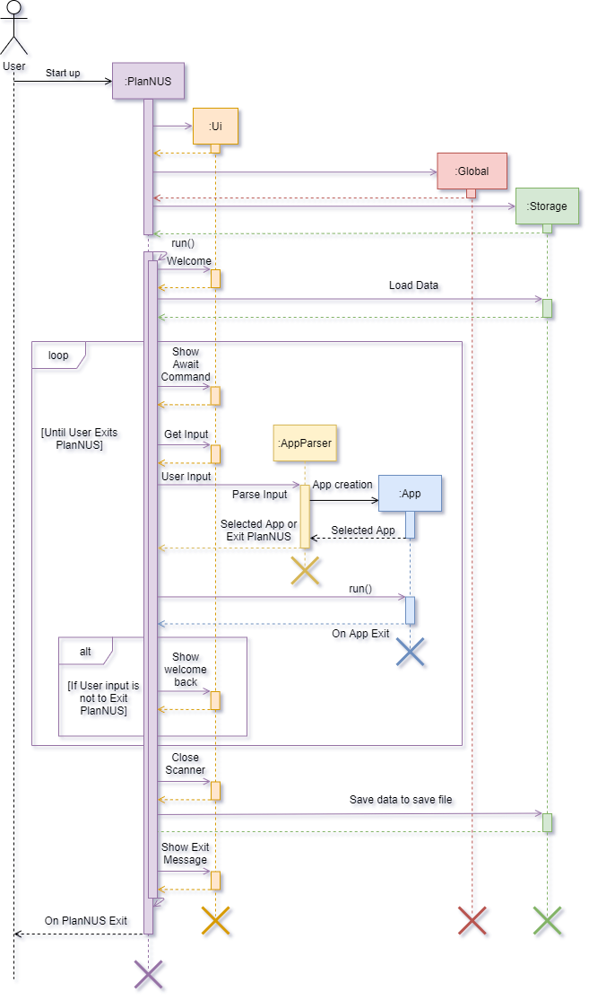

# Developer Guide for PlanNUS

<table><tr><td>

    

</td></tr></table>
Before reading this document, you are recommended to read through the [user guide](https://ay2021s1-cs2113t-f12-1.github.io/tp/UserGuide.html) first.

 

## 1. Table of contents 

* Table of contents
{:toc}
 

## 2. Setting up PlanNUS

First and foremost, the following steps are assuming that you already have a [GitHub](https://github.com) account set up beforehand. Once this has been done, proceed to __fork__ this [repo](https://github.com/AY2021S1-CS2113T-F12-1/tp), and __clone__ the fork into your computer using [Sourcetree](https://sourcetreeapp.com) or any other _Git GUI_.

The _IDE_ to be used should contain the latest version of _Java_ as this is the main programming language for this application. Thus you are highly recommended to use Intellij IDEA.

The following are remaining steps to be taken to finish the set up:

1. Make sure that the version is configured as __JDK 11__.
2. When prompted, __import__ the project as a __Gradle project__ (could take minutes to complete).
3. Enter commands to ensure that PlanNUS functions as expected. You may refer to the _User Guide_ for valid commands.

 

## 3. Design

### 3.1. Architecture

    

The ***Architecture Diagram*** given above explains the high-level design of PlanNUS. Below is a quick overview of each component.

 

### 3.2. Overview

#### 3.2.1. PlanNus

`PlanNus` class contains the `main` and `run` method, which is responsible for

  * At launch

       * Loading all modules for AY2020/21 into PlanNUS

       * Loading previous save file into PlanNUS if available

       * Creation of entry point to available apps in PlanNUS

  * While running

       * Continuously prompt user for app selection

  * At shut down

       * Saving of user data into save file
       * Clean up methods where necessary

 

#### 3.2.2. Global, Ui, Parser, Storage, Apps

* The `global` package contains classes, exceptions and objects that are required across the whole app. 
* The `ui` package contains the class that is responsible for sharing one `scanner` class across the whole app to prevent multiple IO streams
* The `parser` package contains the class that handles user's app selection
* The `storage` package handles loading and saving of user's data to a save file.
* Packages for Available apps such as Academic Planner and CAP Calculator are stored within `apps` package

 

### 3.3. Project Structure

Each package in the PlanNUS as given above follows the following file structure where applicable:

* A functional class that acts as the entry point to that module
* A parser class that parses user input into executable commands by PlanNUS

* `commands`: A package that handles all executable commands given by parser
* `commons`: A package with the utilities and shared classes across the parent package
* `exceptions`: A package to handle all exceptions thrown across the parent package

The interaction within each package should ideally be as shown below.

    

*Note that while this is the ideal case, packages such as* `global`, `parser` *and* `ui` *might not strictly follow this structure due to these package serving a different function altogether (Refer to the sections below for more details.)*

 

### 3.4. Life cycle of PlanNUS

The [*sequence diagram*](#sequence-diagram) below shows how different packages and classes interact with each other throughout the whole [life cycle](#life-cycle) of PlanNUS.

    

 

### 3.5. Details

    

 

#### 3.5.1. Global Component

    

Classes used by multiple components part of the `global` component of PlanNUS. This includes classes such as `App`,`Command` and `LoggingTool`. The main object classes `PartialModule`, `FullModule` and `Person` are also within the global component.

**API** : `src.main.java.global`

 

#### 3.5.2. Storage Component

    

The `Storage` component is responsible for the loading and saving of information from text files.

**API** : `src.main.java.seedu.duke.storage`

 

#### 3.5.3. Parser Component

For the architecture of PlanNUS, the `Parser` classes will belong under the application they will be parsing for. The role 
of these parsers is to process the user's input and return the appropriate command with required parameters to initialise the command. The newly created objects will then be returned to the main command to be executed and thereafter, terminated. 

**API** : `src.main.java.seedu.duke.parser.AppParser`, `src.main.java.seedu.duke.apps.academicplanner.AcademicPlannerParser`, `src.main.java.seedu.duke.apps.capcalculator.CapCalculatorParser` and `src.main.java.seedu.duke.apps.capcalculator.SetSuParser`

 

#### 3.5.4. Ui Component

    

In PlanNUS, the `Ui` component is integral in initialising a `Scanner` class and passing it to methods where they require them. `Ui` also provides functions to output formatted lines to console to improve readability for the user.

**API** : `src.main.java.seedu.duke.ui.Ui`

 

## 4. Implementation

### 4.1. Academic Calendar Planner: Add Module feature

#### 4.1.1. Current implementation

Add module command is executed by `AcademicPlannerParser`. It allows users to add modules into their Academic Planner by instantiating a new `PartialModule` object and adding it into the `userModuleList` and `userModuleMap`. Both the list and hashmap are the _java API_, which are used by importing them. The `Person` object is used to encapsulate both `userModuleList` and `userModuleMap`.

Additionally, the add module command extends the `Command` class and overrides its `execute()` command. An external class, `ModuleValidator` is called upon to validate the various parameters that the user has entered, as to only allow valid modules to be added to the user.

Given below is an example usage scenario and how add module command behaves at each step.

    

__Step 1__ : The user calls the add module command from the `AcademicPlannerParser`, which will initialise a 
`AddModuleCommand`. `AddModuleCommand`'s constructor takes in parameters of `ModuleLoader`, `Person`,`Ui`, 
and `String`. Below is a table of what each parameter corresponds to in the state diagram of the program.

|Parameter (Class Name)|Corresponds to (Function of Class)|Referred to as (Variable Name)|
|:---:|:---:|:---:|
|`ModuleLoader`| Class representing all modules offered by NUS | `allModules` |
|`Person`| Class representing current user's information | `currentPerson`|
|`Ui`| Class representing java's default scanner class | `in`|
|`String` | Class representing the module code to be added | `moduleCode`|

    

__Step 2__ : `execute()` is called from the instance of `AddModuleCommand`. It can throw `AcademicException` 
or `IOException`. `FileHandler` and `Logger` classes from the _java API_ are instantiated to handle logging for the remainder of the `execute()` method. 

__Step 3__ : `in` then reads in the next two lines of input, which is the user's input for the desired semester for the `moduleCode` and `moduleCode`'s grades.

__Step 4__ : `validateInputs()` is called from `ModuleValidator` to validate the user entered data against `allModules`.

__Step 5__ : `AddUtils` is called upon to return module credit for `moduleCode` by `getModuleCreditForModule()`.

    

__Step 6__ :  `AddUtils` is called upon again to add the module's data to the user, by instantiating a new
`PartialModule` and storing it in both `userModuleList` and `userModuleMap` via `Person`.

    

__Step 7__ : `FileHandler`, `Logger`, `PartialModule`, `ModuleValidator`, `AddUtils` and `AddModuleCommand` are terminated.

The following sequence diagram shows how the `AddModuleCommand` works:

    

The following activity diagram summarizes what happens when the user executes a `AddModuleCommand` :

    

#### 4.1.2. Design consideration

The following options were considered when implementing commands:

* Option 1 (Current Implementation): Implementing each command as a class by itself
    * Pros: Increases modularity of code, higher overall code quality 
    * Cons: More complicated to implement
* Option 2: Implementing each command as a method in a class
    * Pros: Easier to implement
    * Cons: Class needs to be instantiated and increases coupling, reducing testability. This method also decreases SLAP.

 

### 4.2. Academic Calendar Planner: Edit Module Feature

#### 4.2.1. Current implementation

Similar to the add module command, the edit module command is also executed by `AcademicPlannerParser`. It allows the user to edit the existing modules added to their `Academic Planner` by accessing the specified `PartialModule` object within the `userModuleList`and `userModuleMap`. 

Given below is an example usage scenario and how add module command behaves at each step.

    

__Step 1:__ The user calls the edit module command from the `AcademicPlannerParser` and  then `EditModuleCommand` will be initialized where its constructor would take in the same parameters as that of `AddModuleCommand`.

__Step 2:__ The `execute()` method is called from the instance of `EditModuleCommand` which only throws `AcademicException` if applicable.

__Step 3:__ Method `isModTakenByUser()` of the `ModuleValidator` is called to check if the `moduleCode` entered by the user exists within the `userModuleList` and `userModuleMap`.

__Step 4:__ `in` reads the next line of input for user's choice of modifying either the semester or grade of the selected `moduleCode`.

__Step 5:__ `isValidSemester()` or `isValidGrade()` is called to validate the semester or grade entered by the user.

__Step 6:__ `updateModuleSemester()` or `updateModuleGrade()` is then called to conduct necessary changes to the information by accessing the module from `userModuleMap` and `userModuleList`.

    

__Step 7:__ `EditModuleCommand`, `EditUtils` and `ModuleValidator` are terminated.

The following sequence diagram shows how `EditModuleCommand` works.

    

The following diagram summarizes what happens when the user executes a `EditModuleCommand`: 

    

 

### 4.3. Academic Calendar Planner: Remove Module Feature

#### 4.3.1. Current implementation

The remove module command is executed by `AcademicPlannerParser` just like the commands for add and edit. This feature allows the user to delete any existing modules added to their Academic Planner.  by first accessing the specified `PartialModule` object within the `userModuleList`and `userModuleMap`.

Given below is an example usage scenario and how remove module command behaves at each step.

    

__Step 1:__ The user calls the remove module command from the `AcademicPlannerParser` and  then `RemoveModuleCommand` will be initialized where its constructor would take in the same parameters as that of `AddModuleCommand` and `EditModuleCommand`.

__Step 2:__ The `execute()` method is called from the instance of `RemoveModuleCommand` which only throws `AcademicException` if applicable.

__Step 3:__ Method `isModTakenByUser()` of the `ModuleValidator` is called to check if the `moduleCode` entered by the user exists within the `userModuleList` and `userModuleMap`.

__Step 4:__ `removeModuleFromUserModuleList()` of `removeUtils` is then called to delete the specified `moduleCode`.

__Step 5:__ The`depopulate()` method deletes the module object by accessing it from `userModuleMap` and `userModuleList` before updating the both the hashmap and the array list.

    

__Step 6:__ `RemoveModuleCommand`, `RemoveUtils` and `ModuleValidator` are terminated.

The following sequence diagram shows how `RemoveModuleCommand` works.

    

The following diagram summarizes what happens when the user executes a `RemoveModuleCommand`: 

    

 

### 4.4. Academic Calendar Planner: View Module Details Feature

#### 4.4.1. Current implementation

View module details command is executed by `AcademicPlannerParser`. It allows the user to view the full details of any module offered by NUS, by accessing the specified `FullModule` object that corresponds to the module code entered by the user, and printing its attributes.

Additionally, the view module details command extends the `Command` class and overrides its `execute()` command. An external class, `ModuleValidator` is called upon to validate the module code that the user has entered, as only the details of valid NUS modules can be displayed.

Given below is an example usage scenario and how add module command behaves at each step.

    

__Step 1:__ The user calls the view module details command from the `AcademicPlannerParser`, which will initialise a `ModuleDetailsCommand`. `ModuleDetailsCommand`'s constructor takes in parameters of  `ModuleLoader` and `String`. Below is a table of what each parameter corresponds to in the state diagram of the program.

| Parameter (Class Name) |        Corresponds to (Function of Class)         | Referred to as (Variable Name) |
| :-------------------------: | :----------------------------------------------------: | :---------------------------------: |
|       `ModuleLoader`        |     Class representing all modules offered by NUS      |            `allModules`             |
|          `String`           | Class representing the module code to print details of |            `moduleCode`             |

__Step 2:__ `execute()` is called from the instance of `ModuleDetailsCommand`. It can throw `AcademicException`.

__Step 3:__ `validateModuleCode()` is called to validate the user input, `moduleCode`, against `allModules`.

__Step 4:__ `PrintUtils` is called to print the details of the module.

    

__Step 5:__ `ModuleDetailsCommand`, `ModuleLoader` and `PrintUtils` are terminated.

The following sequence diagram shows how `ModuleDetailsCommand` works.

    

The following diagram summarizes what happens when the user executes a `ModuleDetailsCommand`: 

    

 

### 4.5. CAP Calculator feature : Set S/U by semester feature

#### 4.5.1. Current implementation

`SetSuBySemesterCommand` is executed by `CapCalculatorApp`. It provides users with a suggestion on how they can S/U their modules added in `AcademicPlannerApp` by retrieving the `userModuleList` from  the `Person` object and filter the list according to the semester provided to get a `suList`.

`suList` will then be analysed to provide user with a list of suggested S/U modules to achieve the best CAP.

 Given below is an example usage scenario and how `SetSuBySemesterCommand` behaves at each step.

    

    

__Step 1:__ The user calls the set S/U command from the `CapCalculatorParser` and the parameters `currentPerson` and `in` will be parsed into `SetSuParser`. `SetSuParser` will then ask for a set S/U method to be parsed. 

__Step 2:__ `in` will read in the next line of input, which decides either `SetSuBySemesterCommand` or `SetSuByModulesCommand` to be parsed into `CapCalculatorApp`. Taking that the user decides to parse the `SetSuBySemesterCommand` by entering _1_.

__Step 3:__ The `execute()` method is called from the instance of `SetSuBySemesterCommand` which only throws `CapCalculatorException` if applicable.

__Step 4:__ `SetSuUtils` is created and the method `promptUserForSemester()` of `SetSuUtils` is called to read the next line of input for user's choice of a semester to S/U.

__Step 5:__  The method `getSuListBySemester()` of `SetSuUtils` is then called to get a list of valid modules that the user can S/U.

    

    

__Step 6:__  The method `showResultsToUser()` of `SetSuUtils` is then called to display the suggestions to user.

__Step 7:__  `SetSuBySemesterCommmand` and `SetSuUltils` are terminated.

    

    

The following sequence diagram shows how `SetSuBySemesterCommand` works.

    

The following diagram summarizes what happens when the user executes a `SetSuBySemesterCommand`: 

    

    
 

## 5. Useful Links

* [**About Us**](https://ay2021s1-cs2113t-f12-1.github.io/tp/AboutUs.html)
* [**Configuration guide**](https://ay2021s1-cs2113t-f12-1.github.io/tp/ConfigurationGuide.html)
* [**DevOps guide**](https://ay2021s1-cs2113t-f12-1.github.io/tp/DevOpsGuide.html)
* [**Documentation guide**](https://ay2021s1-cs2113t-f12-1.github.io/tp/DocumentationGuide.html)
* [**Logging guide**](https://ay2021s1-cs2113t-f12-1.github.io/tp/LoggingGuide.html)
* [**Testing guide**](https://ay2021s1-cs2113t-f12-1.github.io/tp/TestingGuide.html)
* [**User guide**](https://ay2021s1-cs2113t-f12-1.github.io/tp/UserGuide.html)

 

## 6. Appendix: Requirements

### 6.1. Product scope

__Target user profile:__

* has adequate level of familiarization with CLI applications
* requires a clear outlook of academic journey with the modules offered by NUS
* wants to keep track of his or her results and set target grades for the upcoming semester(s)
* prefers using desktop or laptop instead of other electronic devices

__Value proposition:__
Provides NUS undergraduates with a platform to keep track of their academic progress and explore other possibilities with the plethora of modules available. In addition, provides NUS undergraduates with an avenue to have an automatic calculation
of their scores and receive information regarding the use of their Satisfactory / Unsatisfactory options. 

 

### 6.2. User stories

| Version | As a ...                                                  | I want to ...                                                             | So that I can ...                                                                     |
| :-----: | --------------------------------------------------------- | ------------------------------------------------------------------------- | ------------------------------------------------------------------------------------- |
| v1.0    | fresh undergraduate                                       | visualize the modules in the recommended schedule and course requirements | better plan out my academic journey for the next 4-5 years in NUS                     |
| v1.0    | undergraduate with at least 1 semester of study completed | calculate my CAP easily                                                   | forecast my own expected graduation CAP and if they match my expected CAP             |
| v1.0    | undergraduate with at least 1 semester of study completed | print out a personalized list of modules taken so far and grades obtained | track my academic progression in NUS                                                  |
| v2.0    | user of PlanNUS                                           | find modules I have completed in a particular semester                    | view specific information I require about that semester without redundant information |
| V2.0    | user of PlanNUS                                           | easily access my last made list                                           | save time on retyping my academic calendar after each use                             |
| V2.0    | user of PlanNUS                                           | view module details                                                       | make an informed decision on which modules to take up during the semester             |
| V2.0    | user of PlanNUS                                           | search modules by their partial keys                                      | view more modules with similar subject codes                                          |
| V2.0    | undergraduate with at least 1 semester of study completed | have suggestions on which modules to mark as S/U                          | make an informed decision on which modules to S/U                                     |

 

### 6.3. Use cases

 

__Use case 1: Add a module to academic calendar__

**Preconditions: User is in the Academic Planner app.**

__MSS__ 

1. User chooses to add a module to their academic calendar.

2. PlanNUS prompts user to enter semeseter that they plan to take the module.

3. User enters semester that they plan to take the module.

4. PlanNUS prompts user to enter grade received for the module.

5. User enters grade received for the module.

6. PlanNUS adds the module to the user's academic calendar, and displays a confirmation message

   Use case ends.

__Extensions__

- 1a. User did not specify a module code while adding a module.
  - 1a1. PlanNUS shows a _missing parameter_ error message.
    Use case ends.

- 1b. User enters a module code that is not offered by NUS.
  - 1b1. PlanNUS shows an _invalid module code_ error message.
    Use case ends.

- 3a. User enters an invalid semester.
  - 3a1. PlanNUS shows an _invalid semester_ error message.
    Use case ends.

- 5a. User enters an invalid grade.
  - 5a1. PlanNUS shows an _invalid grade_ error message.
    Use case ends.

 

**Use case 2: Edit a module in academic calendar**

**Preconditions: User is in the Academic Planner app.**

__MSS__ 

1. User chooses to edit a module currently in their academic calendar.
2. PlanNUS prompts user to indicate the feature (semester/grade) that they would like to edit.
3. User chooses feature to edit.
4. PlanNUS prompts user to enter updated value for chosen feature.
5. User enters updated value.
6. PlanNUS edits the value accordingly, stores the updated value in the user's academic calendar, and displays a confirmation message.

Use case ends.

__Extensions__

- 1a. User did not specify a module code while editing a module.
  - 1a1. PlanNUS shows a _missing parameter_ error message.
    Use case ends.

- 1b. User enters a module code that is not offered by NUS.
  - 1b1.  PlanNUS shows an _invalid module code_ error message.
    Use case ends.
- 1c. User enters a module code that is offered by NUS, but is not currently in the user's academic calendar.
  - 1c1. PlanNUS shows a _module not in calendar_ error message.
    Use case ends.
- 3a. User chooses a feature that is invalid.
  - 3a1. PlanNUS shows an _invalid feature_ error message.
    Use case ends.
- 5a. User enters an updated value that is invalid.
  - 5a1. PlanNUS shows an _invalid value_ error message.
    Use case ends.

 

**Use case 3: Remove a module from academic calendar**

**Preconditions: User is in the Academic Planner app.**

__MSS__ 

1. User chooses to remove a module currently in their academic calendar.

2. PlanNUS removes the corresponding module from the user's academic calendar, and displays a confirmation message.

   Use case ends.

__Extensions__

- 1a. User did not specify a module code while removing a module.
  - 1a1. PlanNUS shows a _missing parameter_ error message.
    Use case ends.

- 1b. User enters a module code that is not offered by NUS.
  - 1b1.  PlanNUS shows an _invalid module code_ error message.
    Use case ends.
- 1c. User enters a module code that is offered by NUS, but is not currently in the user's academic calendar.
  - 1c1. PlanNUS shows a _module not in calendar_ error message.
    Use case ends.

 

**Use case 4: View details of a module**

**Preconditions: User is in the Academic Planner app.**

__MSS__

1. User chooses to view details of a module.

2. PlanNUS prints the details of the corresponding module.

   Use case ends.

__Extensions__

- 1a. User did not specify a module code while viewing details of a module.
  - 1a1. PlanNUS shows a _missing parameter_ error message.
    Use case ends.

- 1b. User enters a module code that is not offered by NUS.
  - 1b1.  PlanNUS shows an _invalid module code_ error message.
    Use case ends.

 

**Use case 5: Search for a module**

**Preconditions: User is in the Academic Planner app.**

__MSS__

1. User searches for a module, based on the module code.

2. PlanNUS displays the search results, up to and including the first 10 results.

   Use case ends.

__Extensions__

- 1a. User did not specify a module code while searching for a module.
  - 1a1. PlanNUS shows a _missing parameter_ error message.
    Use case ends.

 

**Use case 6: View academic calendar**

**Preconditions: User is in the Academic Planner app.**

__MSS__

1. User chooses to view their current academic calendar.

2. PlanNUS prompts user to indicate their desired viewing timeframe, i.e. 

   a) the full academic calendar, or 

   b) view a particular semester only.

3. User specifies their desired timeframe.

4. PlanNUS displays the academic calendar accordingly.

   Use case ends.

__Extensions__

- 1a. User's academic calendar is currently empty.
  - 1a1. PlanNUS shows an _empty calendar_ error message.
    Use case ends.
- 3a. User did not specify a valid timeframe.
  - 3a1. PlanNUS shows an _invalid timeframe_ error message.
    Use case ends.
- 3b. User specifies a valid semester, but there are no modules added to that semester yet.
  - 3b1. PlanNUS shows an _empty semester_ error message.
    Use case ends.

 

**Use case 7: View list of available commands **

**Preconditions: User is in the Academic Planner app.**

__MSS__

1. User chooses to view the list of available commands in the Academic Planner app.
2. PlanNUS displays the list of available commands.

 

**Use case 8: Exit back to PlanNUS **

**Preconditions: User is in the Academic Planner app.**

__MSS__

1. User chooses to exit from the Academic Planner app back to the PlanNUS main menu.
2. PlanNUS exits back to the PlanNUS main menu.

 

### 6.4. Non-Functional Requirements

* General
    * Should work on any [mainstream OS](#mainstream-os) as long as it has Java `11` or above installed.
    * Commands entered should be short and intuitive to reduce mistyping of commands
    * Program should be compatible on a wide range of devices
* Academic Planner
    * Viewing of Academic Calendar should be intuitive as a complicated or messy output compromises usability of PlanNUS
    * Only verified modules offered by NUS should be able to be added to prevent confusion
    * The navigation between applications should be intuitive
* CAP Calculator
    * Data should be shared between applications in order to reduce redundant typing from the user

 

### 6.5. Glossary

#### Mainstream OS
Windows, Linux, Unix, OS-X

#### Life cycle
The duration in which the object is running and alive.

#### Sequence Diagram
A UML diagram that captures the interactions between multiple objects for a given scenario.

 

## 7. Features Coming Soon (V3.0 and beyond)

* Logging of program to separate folders
* Support retaking of modules
* Support max limit for the `Set SU` function in `capcalc`
* Saving data after every command
* Support discontinued modules from NUS
* Support shortened commands for parsers
* Support validation of requirements for modules

 

## 8. Appendix: Instructions for manual testing

{More to be added}
