# User Guide for PlanNUS

<!-- @@author jerroldlam -->

<table><tr><td>

    

</td></tr></table>
Hello user of PlanNUS! Welcome to the user guide for our software. In this guide, you can find information regarding how to use PlanNUS and the common questions asked with regards to the usage of PlanNUS. We hope you find this software
useful and we wish you all the best for your academic journey in NUS.

 

## 1. Overview

PlanNUS is a __desktop application for undergraduates who wish to plan their academic journey__, with modules offered by National University of Singapore (NUS). The __Command Line Interface (CLI)__ will be required for the program to work.

PlanNUS aims to address the gap of undergraduate academic planning in NUS, by providing an avenue for NUS students to plan their full academic journey. PlanNUS can also generate CAP statistics and even suggest which modules to mark as satisfactory/unsatisfactory (S/U), in order to achieve the highest CAP possible. 

In addition, PlanNUS has saving and loading features, which reduces the hassle of re-entering the full academic calendar during each use.

The sections below explain how PlanNUS should be used, and the common errors faced by users. Sections can be easily navigated to by clicking on the hyperlinks in the table of contents.

 

## 2. Table of contents

* Table of Contents
{:toc}
 

<!-- @@author Khenus -->

## 3. Quick Start

1. Ensure that you have Java 11 or above installed.
1. Download the latest version of `PlanNUS` [here](https://github.com/AY2021S1-CS2113T-F12-1/tp/releases "PlanNUS releases").
1. Double click on _PlanNUS.jar_ to start up the program.
1. If the previous step does not work, open up the command prompt.
1. Go to the directory where the jar file is saved.
1. Enter the following command `java -jar PlanNus.jar`

[Back to Table of Contents](#2-table-of-contents)

 

<!-- @@author jerroldlam -->

## 4. Feature List (for V2.1)

* Academic Calendar Planner
    * Add module
    * Edit module
    * Remove module
    * View module details
    * Search for module by keyword
    * Print Calendar
        * Full Calendar
        * Semester Calendar
* CAP Calculator
    * Get current CAP
    * Get results need for target CAP
    * See possible CAP when setting as grade-less
* General
    * Saving of Academic Calendar into text file
    * Loading of Academic Calendar from text file

[Back to Table of Contents](#2-table-of-contents)

 

<!-- @@author Khenus -->

## 5. Command Summary

Note: All commands are **case-insensitive**.

 

To enter the __Academic Planner__: `acadplan` or `a`

Commands within the Academic Planner:

| __Action__                                  | __Command__                                                  |
| ------------------------------------------- | ------------------------------------------------------------ |
| Adding a module into the calendar           | `add <module code>`​   e.g., `add CS1010, ADD cs1231 , ADD CS2040` |
| Editing an existing module in the calendar  | `edit <module code>`​   e.g., `edit CS1010, EDIT cs1231 , EDIT CS2040` |
| Removing an existing module in the calendar | `remove <module code>`​   e.g., `remove CS1010, REMOVE cs1231 , REMOVE CS2040` |
| Viewing the details of a module             | `details <module code>`  e.g. `details CS1010`, `DETAILS cs1231`, `DETAILS CS2040` |
| Searching for modules by keyword            | `search <module code key` e.g. `search CS`, `SEARCH cs12`, `SEARCH CS2040` |
| Printing the academic calendar              | `view`                                                       |
| Printing help information for Academic Planner| `help`                                                       |
| Switching to the _CAP Calculator_ app       | `capcalc`                                                    |
| Exiting the Academic Planner                | `exit`                                                       |

* **Note:** `acadplan` can be called from both the `PlanNUS` main menu, and from within the _CAP Calculator_ app.
* **Caution:** Once you have achieved a passing grade for a module, you will be unable to add the same module into your calendar again.
* **Caution:** If you have multiple failing grades from the same module, you will only be able to edit the grade of the latest module to a passing grade.
* **Caution** Failed modules cannot be shifted ahead of the same module with a passing grade, and vice versa. 
* **Caution:** Grades cannot be edited such that a module with a failing grade will be ahead of the same module with a passing grade.

[Back to Table of Contents](#2-table-of-contents)

 

To enter the __CAP Calculator__: `capcalc` or `c`

Commands within the CAP calculator:

| __Action__                              | __Command__  |
| --------------------------------------- | :----------- |
| Printing current CAP and MCs taken      | `current`    |
| Setting target CAP                      | `set target` |
| Marking a module grade as S/U           | `set su`     |
| Printing help information for CAP Calculator| `help`       |
| Switching to the _Academic Planner_ app | `acadplan`   |
| Exiting the CAP Calculator              | `exit`       |

**Note:** `capcalc` can be called from both the `PlanNUS` main menu, and from within the _Academic Planner_ app.

[Back to Table of Contents](#2-table-of-contents)

 

## 6. Features 

From the PlanNUS main page, you can choose to enter two separate apps:

1. _Academic Calendar Planner_ - have an outlook of your potential academic journey.
1. _CAP Calculator_ - calculate and forecast your CAP.

For each of these commands, there are more specific functions for the configuration of your desired choices.

<table><tr><td>

    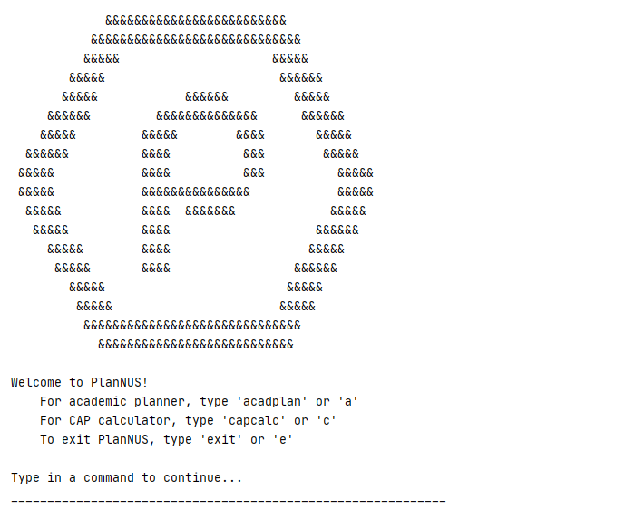  

</td></tr></table>

[Back to Table of Contents](#2-table-of-contents)

 

### 6.1. Academic Calendar Planner: `acadplan` or `a`

Directs you to the _Academic Planner_ app, where you can plan a personalized academic journey in NUS by using `add`, `remove`, `view` or `edit` features as shown below.
Note: You can choose to switch to the _Academic Planner_ app from within the _CAP Calculator_ app or the PlanNUS main menu.

Input format: `acadplan`  or `a`

<table><tr><td>

    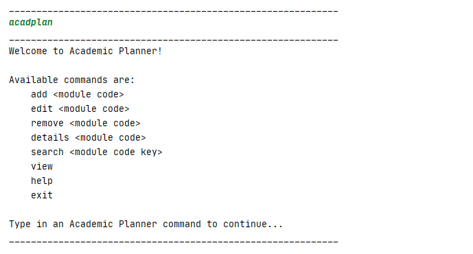

</td></tr></table>

[Back to Table of Contents](#2-table-of-contents)

 

#### 6.1.1. Adding a module into the calendar: `add`

<!-- @@author jerroldlam -->

The following command is for you to add in a new module entry to your academic calendar.

Input format: `add <module code>`

**Example of proper usage:**

* `add CS2113T`
* `ADD cs2101`

Upon entering the add command with the module code, you will be prompted to enter two additional fields of information: the semester you wish to take the module, and the corresponding grade attained.

<table><tr><td>

    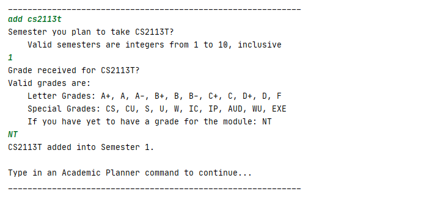

</td></tr></table>
__<ins>Caution</ins>:__ 

* Invalid module codes (i.e. Modules not offered by NUS) cannot be added into the calendar.
* Duplicate module codes cannot be added into the calendar, unless a failing grade has been tagged with that module.
* Invalid semester indexes will be rejected by PlanNUS. For more information, visit [Appendix](#101-naming-convention-for-semester-indexes) for a list of valid semester indexes.
* Invalid grade values will be rejected by PlanNUS. For more information, visit [Appendix](#102-grade-values) for a list of valid grade values.
* When an invalid command is entered, you will be brought back to the main page of the academic planner, where you can re-enter the command with the correct information again.   

[Back to Table of Contents](#2-table-of-contents)

 

#### 6.1.2. Editing an existing module in the calendar: `edit`

<!-- @@author harryleecp -->

This `edit` command is for you to edit an existing module entry.

Input format: `edit <module code>`

Example of usage:

* `edit CS2113T`
* `EDIT cs2101`

As shown in the images below, you can choose to edit either the _Semester_ or _Grade_ of the selected module. (__Note:__ Enter either `1` or `2` instead of the component's name)

Expected output when you wish to change the _Semester_.

<table><tr><td>

    

</td></tr></table>

Expected output when you wish to change the _Grade_.

<table><tr><td>

    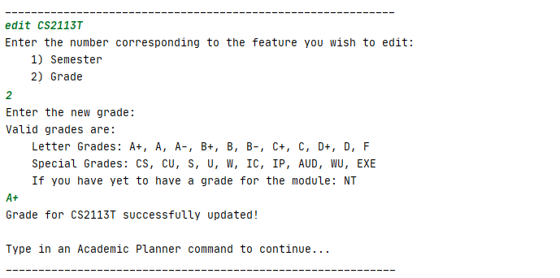

</td></tr></table>

__<ins>Caution:</ins>__ 

* Only modules that have been added into the calendar can be edited

[Back to Table of Contents](#2-table-of-contents)

 

#### 6.1.3. Removing an existing module in the calendar: `remove`

This function removes an existing module entry from your academic calendar.

Input format: `remove <module code>`

Example of usage:

* `remove cs2113T`
* `REMOVE CS2101`

<table><tr><td>

    

</td></tr></table>
__<ins>Caution:</ins>__ 

* Only modules that have been added into the calendar can be removed
  

[Back to Table of Contents](#2-table-of-contents)

 

#### 6.1.4. Viewing the details of a module: `details`

<!-- @@author vanessa-kang -->

This command is for you to view the detailed information of a particular module.

Input format: `details <module code>`

Example of usage:

* `details CS2101`
* `DETAILS cs2113t`

<table><tr><td>

    

</td></tr></table>
As shown in the image, you can input the module that they wish to view further details about.

__<ins>Caution:</ins>__ 

* No information will be printed if the module is not offered by NUS.

[Back to Table of Contents](#2-table-of-contents)

 

#### 6.1.5. Searching for module codes containing a keyword: `search`

This command is for when you are unsure of the full module code.

Input format: `search <module code key>`

Example of usage:

* `search CS21`
* `SEARCH cg4002`
<table><tr><td>

    

</td></tr></table>

<table><tr><td>

    

</td></tr></table>
As shown above, you can enter a search key that contains either part of, or the whole module code.

__<ins>Caution:</ins>__ 

* This feature currently only supports searching by module code.
* Only up to the first 10 results are displayed.  

[Back to Table of Contents](#2-table-of-contents)

 

#### 6.1.6. Printing the academic calendar: `view`

This command is for when you want to view your academic calendar, in partial or in full.

Input format: `view`

You can choose from printing the full calendar by typing `full` or printing a specific semester by typing a number from 1-10, inclusive.

Expected output when you wish to print the `full` calendar:

<table><tr><td>

    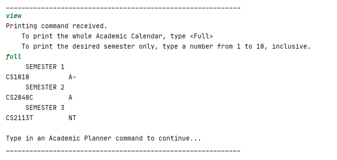

</td></tr></table>

Expected output when you wish to print a specific semester:

<table><tr><td>

    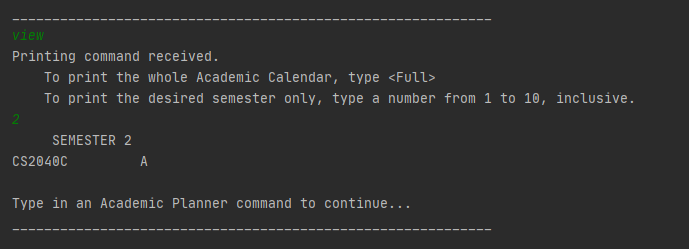

</td></tr></table>

[Back to Table of Contents](#2-table-of-contents)

 

#### 6.1.7. Printing help for academic calendar: `help`

This command is for when you are unsure of what commands are available in `acadplan`.

Input format: `help`

<table><tr><td>

    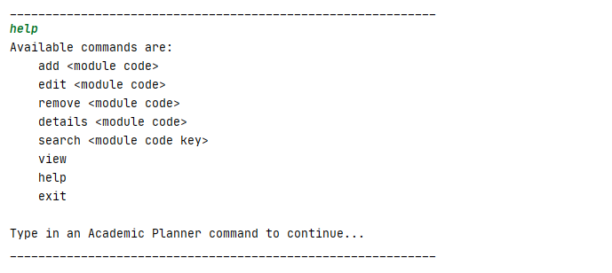

</td></tr></table>

[Back to Table of Contents](#2-table-of-contents)

 

#### 6.1.8. Switching to the _CAP Calculator_ app: `capcalc`

<!-- @@author Khenus -->

This command is for you to switch to the _CAP Calculator_ app.

Input format: `capcalc`

Note: You can also choose to switch to the CAP Calculator_ app from the PlanNUS main menu.

<table><tr><td>

    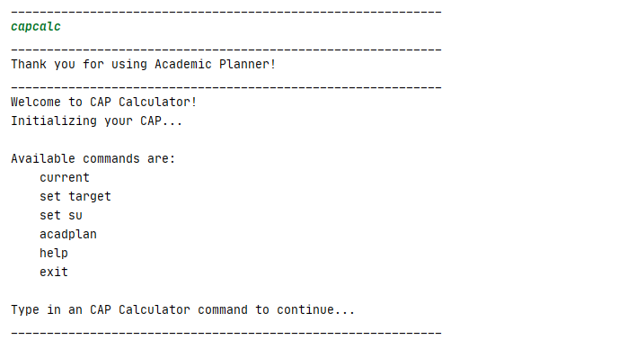

</td></tr></table>

[Back to Table of Contents](#2-table-of-contents)

 

### 6.2. Cap Calculator: `capcalc`

Directs you to the _CAP Calculator_ app where he/she can view the `current` CAP or even `set target` CAP to be met in the upcoming semester(s) from **Main Menu**. 

Input format: `capcalc` or `c`

<table><tr><td>

    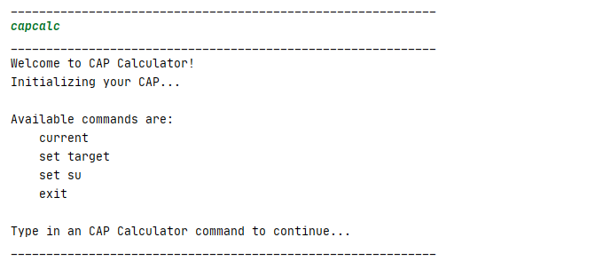

</td></tr></table>

[Back to Table of Contents](#2-table-of-contents)

 

#### 6.2.1. Printing current CAP and MCs taken: `current`

<!-- @@author JuZihao -->

This command shows you your current CAP, Current Graded MCs and Total number of MCs taken.

Input format: `current`

<table><tr><td>

    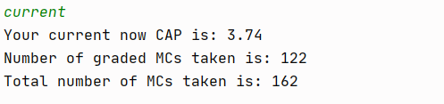

</td></tr></table>

__<ins>Caution:</ins>__

* The value of CAP depends entirely on the modules and their corresponding grades that you have added into the Academic Calendar Planner.
* If there are no modules added, the current CAP and graded MCs are set to 0.

[Back to Table of Contents](#2-table-of-contents)

 

#### 6.2.2. Set target CAP: `set target`

This command is for you to set a target CAP that you wish to obtain for the next specified graded MCs.

Input format: `set target`

<table><tr><td>

    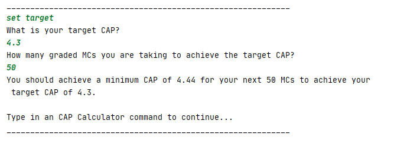

</td></tr></table>

__<ins>Caution:</ins>__

* CAP should be between 0.00 to 5.00 inclusive.
* MC should be between than 1 to 180 inclusive.

[Back to Table of Contents](#2-table-of-contents)

 

#### 6.2.3. Set S/U modules: `set su`

This command is for you to set modules that you wish to S/U.

<table><tr><td>

    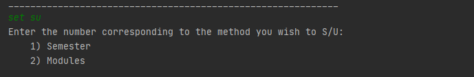

</td></tr></table>
As shown in the image, you can choose to S/U by either a _Semester_ or some selected _Modules_. (__Note:__ Enter either `1` or `2` instead of the component's name)

 

##### 6.2.3.1. Set S/U by semester

Below shows the expected output when you wish to S/U by _Semester_.

You will be prompted to enter a specific semester that you wish to S/U. The following will show if the entered *Semester* is valid.

<table><tr><td>

    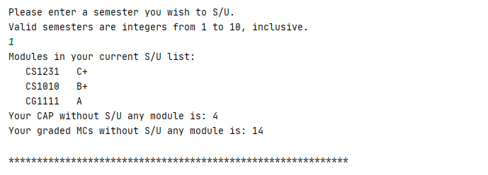

</td></tr></table> 

You will be first shown the *S/U list* which consists of a sorted list of valid modules according to your grades and your current CAP and graded MCs.

__<ins>Caution:</ins>__ 

* Only modules that can be S/Ued are added into the S/U list.
* Modules with special grades are filtered out.

<table><tr><td>

    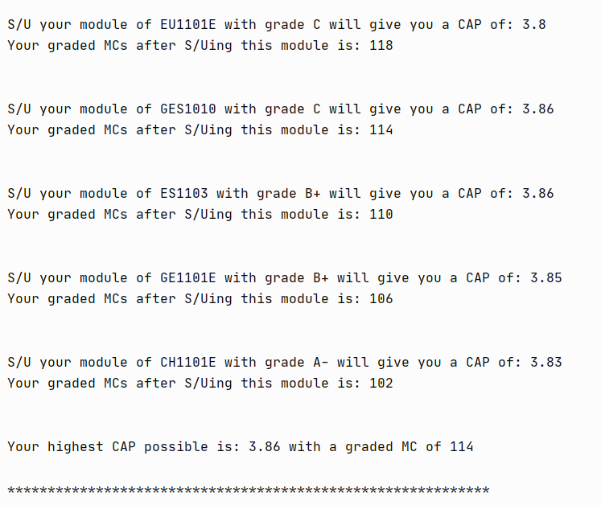

</td></tr></table> 
Modules will be S/Ued starting from the lowest grade and will be displayed with the corresponding updated CAP.
You will also be shown the highest possible CAP that you can obtain.

<table><tr><td>

    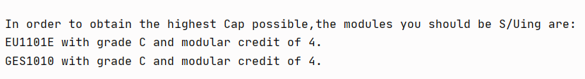

</td></tr></table> 
Lastly, you will be shown the modules that you should S/U in order to obtain the highest CAP possible.

[Back to Table of Contents](#2-table-of-contents)

 

##### 6.2.3.2. Set S/U by modules

Below shows the expected output when you wish to S/U by _Modules_.

You will be prompted to enter a specific number of modules to S/U and the module codes to be S/Ued. The following will show if the all the fields are valid.

<table><tr><td>

    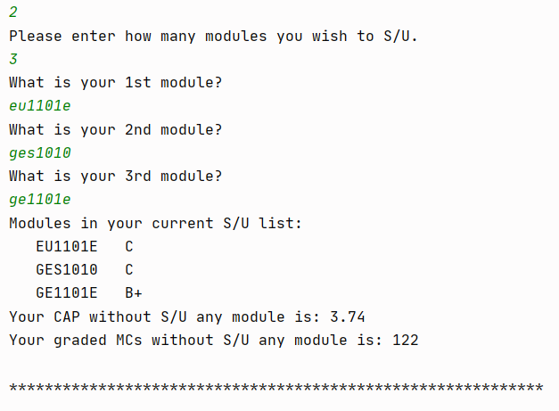

</td></tr></table>

You will be shown the *S/U list* which consists of a sorted list of valid modules according to your grades and your current CAP and graded MCs.

__<ins>Caution:</ins>__ 

* Duplicate modules are not allowed.
* Number of modules to be S/Ued should not be greater than number of modules that you have taken.

 <table><tr><td>

    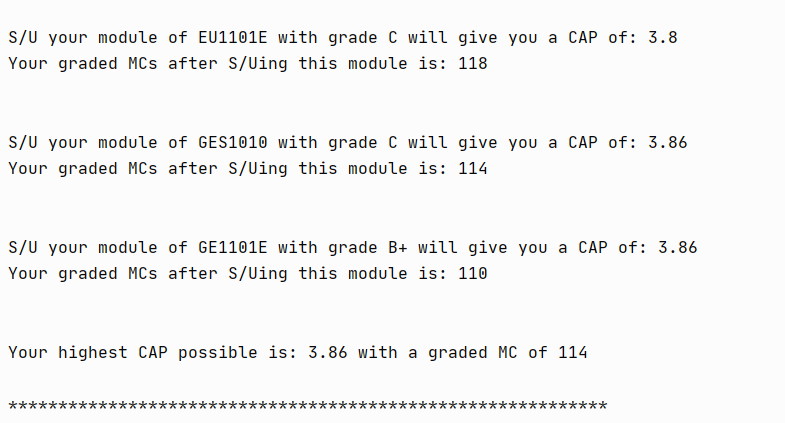

</td></tr></table>
Modules will be S/Ued starting from the lowest grade and will be displayed with the corresponding updated CAP.
You will also be shown the highest possible CAP that you can obtain.

<table><tr><td>

    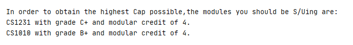

</td></tr></table>
Lastly, you will be shown the modules that you should S/U in order to obtain the highest CAP possible.

[Back to Table of Contents](#2-table-of-contents)

 

#### 6.2.4. Printing help for CAP Calculator: `help`

This command is for when you are unsure of what commands are available in `capcalc`.

Input format: `help`

<table><tr><td>

    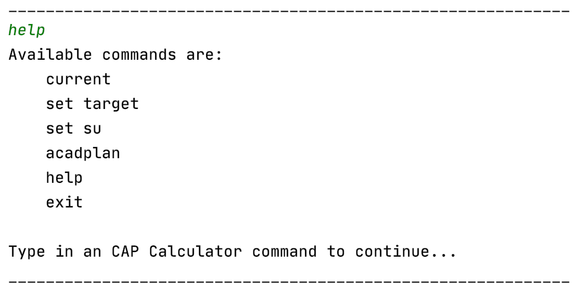

</td></tr></table>

[Back to Table of Contents](#2-table-of-contents)

 

#### 6.2.5. Switching to the _Academic Planner_ app: `acadplan`

This command is for you to switch to the _Academic Planner_ app.

Input format: `acadplan`

Note: You can also choose to switch to the _Academic Planner_ app from the PlanNUS main menu.

<table><tr><td>

    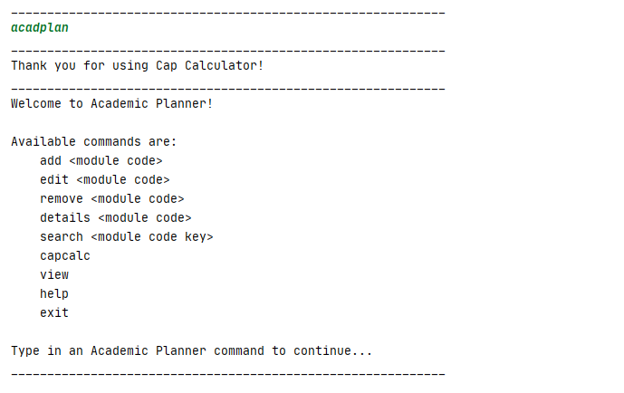

</td></tr></table>

[Back to Table of Contents](#2-table-of-contents)

 

### 6.3. Exiting from a feature or PlanNUS: `exit`

This command directs you back to the main page of PlanNUS after you are done using a feature, or wish to exit from the entire software itself.

Input format: `exit`

When you exit from the _Academic Planner_, expected output is as follows:

<table><tr><td>

    

</td></tr></table> 
When you exit from the _CAP calculator_, expected output is as follows:

<table><tr><td>

    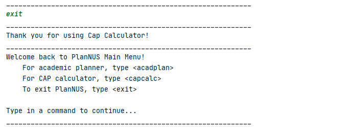

</td></tr></table> 
Last but not least, the expected output when you exit from PlanNUS is as follows:

<table><tr><td>

    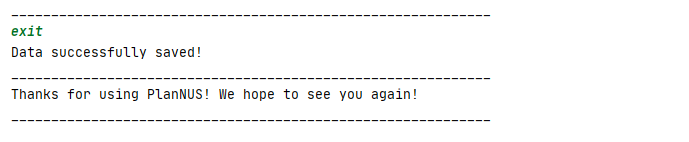

</td></tr></table> 

[Back to Table of Contents](#2-table-of-contents)

## 7. Loading and Saving 

<!-- @@author Khenus -->

Upon running PlanNUS in the command prompt, the program automatically looks for a text file with the name _PlanNUS.txt_ within the same folder as _PlanNUS.jar_. 

If the text file cannot be found, then the following output will be shown on the main page of PlanNUS, before the list of commands.

<table><tr><td>

    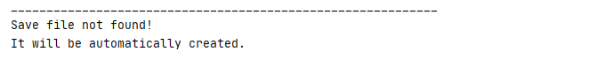

</td></tr></table> 

If an empty save file exists, the following output will be displayed instead.

<table><tr><td>

    

</td></tr></table> 

All the added modules will be saved into _PlanNUS.txt_ after you exit from the program. The next time the program is run again, it will load the previously saved configurations, and will generate the following output.

<table><tr><td>

    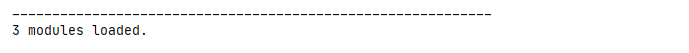

</td></tr></table> 
Note that the image above is merely an example, since the exact output depends on the number of modules saved in the text file.

[Back to Table of Contents](#2-table-of-contents)

 

## 8. FAQ

<!-- @@author jerroldlam -->

Question Type|Question|Answer
:---:|---|---
General | How do I check which modules are offered by NUS? | For more info on which modules are offered by NUS, visit [here](https://nusmods.com/modules?sem[0]=1&sem[1]=2&sem[2]=3&sem[3]=4 "NUSMODS").
General | What is a valid semester index? | For the purpose of this planning software, we have come to a decision to limit the maximum number of semesters an undergraduate can take to 10, which is 5 academic years. The notation they are represented by is by an integer of value 1 to 10. For a fresh undergraduate, they will begin at semester index of 1. For a year 3 student who is currently in semester 1, the semester index will be 5. Please refer to the appendix for more information.
General | What is a valid grade? | **Letter Grades**: A+, A, B+, B, B-, C+, C, D+, D, F , **Special Grades**: CS, CU, S, U, W, IC, IP, AUD, WU, EXE, **If you have yet to obtain a grade for the module**: NT 
General | What is the name of the saved file? | The name of the saved file is `PlanNUS.txt` and can be found at the base of the folder, in the same location as your PlanNUS.jar. 

[Back to Table of Contents](#2-table-of-contents)

 

## 9. Useful Links

* [**About Us**](https://ay2021s1-cs2113t-f12-1.github.io/tp/AboutUs.html)
* [**Configuration guide**](https://ay2021s1-cs2113t-f12-1.github.io/tp/ConfigurationGuide.html)
* [**Developer guide**](https://ay2021s1-cs2113t-f12-1.github.io/tp/DeveloperGuide.html)
* [**DevOps guide**](https://ay2021s1-cs2113t-f12-1.github.io/tp/DevOpsGuide.html)
* [**Documentation guide**](https://ay2021s1-cs2113t-f12-1.github.io/tp/DocumentationGuide.html)
* [**Logging guide**](https://ay2021s1-cs2113t-f12-1.github.io/tp/LoggingGuide.html)
* [**Testing guide**](https://ay2021s1-cs2113t-f12-1.github.io/tp/TestingGuide.html)

[Back to Table of Contents](#2-table-of-contents)

 

## 10. Appendix

### 10.1. Naming convention for semester indexes

For the purpose of this planning software, _PlanNUS_ limits the maximum number of semesters an undergraduate can take to 10, which is equivalent to 5 academic years. Each semester is indexed by an integer between 1 and 10. If you are a fresh undergraduate, you will begin at semester index of 1. For a year 3 student who is currently in semester 1, your semester index will be 5. Below is a table which illustrates the corresponding semester indexes for undergraduates:

| Academic Year | Semester (as of Academic Year) | Semester Index |
| :-----------: | :----------------------------: | :------------: |
|       1       |               1                |       1        |
|       1       |               2                |       2        |
|       2       |               1                |       3        |
|       2       |               2                |       4        |
|       3       |               1                |       5        |
|       3       |               2                |       6        |
|       4       |               1                |       7        |
|       4       |               2                |       8        |
|       5       |               1                |       9        |
|       5       |               2                |       10       |

[Back to Table of Contents](#2-table-of-contents)

 

### 10.2. Grade values

As per NUS [Grade Policy](http://www.nus.edu.sg/registrar/academic-information-policies/undergraduate-students/modular-system "NUS Official Site"), letter grades will have a corresponding Academic Point attached to them. Special cases such as Satisfactory/Unsatisfactory (SU) grades can be captured by our software as well. Below is a table of grades and their corresponding grade value. Do note that the grades of forecasted modules should be declared as NT, short for Not Taken.

|            Grade            | Academic Points |
| :-------------------------: | :-------------: |
|             A+              |       5.0       |
|              A              |       5.0       |
|             A-              |       4.5       |
|             B+              |       4.0       |
|              B              |       3.5       |
|             B-              |       3.0       |
|             C+              |       2.5       |
|              C              |       2.0       |
|             D+              |       1.5       |
|              D              |       1.0       |
|              F              |       0.0       |
| Additional Grading Options* |        -        |

*Additional Grading options include S,U,CS,CU,IC,IP,AUD,EXE,W,WU. They hold no Academic Point Value.

[Back to Table of Contents](#2-table-of-contents)

 

## 11. Features Coming Soon (V3.0 and beyond)

* Support max limit for the `Set SU` function in `capcalc`
* Support discontinued modules from NUS
* Support shortened commands for parsers
* Support validation of requirements for modules

[Back to Table of Contents](#2-table-of-contents)

 

#### *End of User Guide*