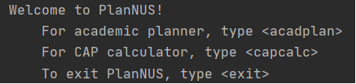

# User Guide

PlanNUS is a __desktop application for planning academic journey__ with modules offered by National University of Singapore (NUS). The __Command Line Interface (CLI)__ will be required for the program to work.

## Table of Contents

- [Quick Start](#Quick Start)
- [Features](#Features)
  - [Academic Calendar Planner: `acadPlan`](#Academic Calendar Planner: `acadPlan`)
    - [Adding a module into the calendar: `add`](#Adding a module into the calendar: `add`)
    - [Removing an existing module in the calendar: `remove`](#Removing an existing module in the calendar: `remove`)
    - [Editing an existing module in the calendar: `edit`](#Editing an existing module in the calendar: `edit`)
    - [Printing the academic calendar: `view`](#Printing the academic calendar: `view`)
  - [CAP calculator: `capCalc`](#CAP calculator: `capCalc`)
    - [Printing current CAP and MCs taken: `current`](#Printing current CAP and MCs taken: `current`)
    - [Configure current CAP and graded MCs: `set current`](#Configure current CAP and graded MCs: `set current`)
    - [Set target CAP: `set target`](#Set target CAP: `set target`)
    - [Make the module grade as S/U: `set SU`](#Make the module grade as S/U: `set SU`)
  - [Exiting from a feature: `exit`](#Exiting from a feature)
- [FAQ](#FAQ)
- [Command Summary](#Command Summary)
- [Appendix](#Appendix)

## Quick Start

1. Ensure that you have Java 11 or above installed.
1. Down the latest version of `PlanNUS` from [here](http://link.to/duke).
1. Double click on _PlanNUS.jar_ to start up the program.
1. If the previous step does not work, open up the command prompt.
1. Go to the directory where the jar file is saved at.
1. Enter the following command `java -jar PlanNUS.jar`

## Features 

PlanNUS has two separate commands at the main page where the users can either choose to have an outlook of their potential academic journey or calculate their CAP. For each of these commands, there are more specific functions for configuration of user's desired choices.

### Academic Calendar Planner: `acadPlan`
Directs user to the page where he/she can plan a personalized academic journey in NUS by using `add`, `remove` or `edit` features as shown below.

{Photo here}

Input format: `acadPlan`

#### Adding a module into the calendar: `add`

Input format: `add <module code>`

Example of usage: 

* `add CS2113T`
* `ADD cs2101`

{Photo here}

__<ins>Caution</ins>:__ 

* Invalid module codes (i.e. Modules not offered by NUS) cannot be added into the calendar
* Duplicate module codes cannot be added into the calendar as well

#### Removing an existing module in the calendar: `remove`

Input format: `remove <module code>`

Example of usage:

* `remove cs2113T`
* `REMOVE CS2101`

{Photo here}

__<ins>Caution:</ins>__ 

* Only modules that have been added into the calendar can be removed

#### Editing an existing module in the calendar: `edit`

Input format: `edit <module code>`

Example of usage:

* `edit CS2113T`
* `EDIT cs2101`

{Photo here}

__<ins>Caution:</ins>__ 

* Only modules that have been added into the calendar can be edited

#### Printing the academic calendar: `view`

Input format: `view`

{Photo here}

### Cap Calculator: `capCalc`

#### Printing current CAP and MCs taken: `current`

Input format: `current`

{Photo here}

__<ins>Caution:</ins>__

* Initializing the current CAP reads in all the modules added by the user in Academic Calendar Planner.
* If there are no modules added, the current CAP and graded MCs are set to 0

#### Configure current CAP and graded MCs: `set current`

Input format: `set current`

{Photo here}

__<ins>Caution:</ins>__

* Maximum CAP is 5.0

#### Set target CAP: `set target`

This is for the user to set a target CAP that he or she wishes to obtain for the specified graded MCs.

Input format: `set target`

{Photo here}

__<ins>Caution:</ins>__

* Maximum CAP is 5.0

#### Make the module grade as S/U: `set SU`

Input format: `set SU`

When prompted for the module that user has taken, the input format will be as such:
`<module code> <grade> <MCs>`    (Example: `CS2113T B+ 4`)

{Photo here}

### Exiting from a feature: `exit`

This command directs user back to the main page of PlanNUS after they are done using a feature. 

{Photo here}

Input format: `exit`

## FAQ

**Q**: How do I transfer my data to another computer? 

**A**: {your answer here}

## Command Summary

Note that the following commands are case-insensitive.

* Initiate the __Academic Calendar Planner__: `acadPlan`

| __Action__                                  | Command                |
| ------------------------------------------- | ---------------------- |
| Adding a module into the calendar           | `add <module code>`    |
| Removing an existing module in the calendar | `remove <module code>` |
| Editing an existing module in the calendar  | `edit <module code>`   |
| Printing the academic calendar              | `view`                 |

* Initiate the __CAP calculator__: `capCalc`

| __Action__                           | __Command__   |
| ------------------------------------ | ------------- |
| Printing current CAP and MCs taken   | `current`     |
| Configure current CAP and graded MCs | `set current` |
| Set target CAP                       | `set target`  |
| Make the module grade as S/U         | `set SU`      |

* To exit to the main page: `exit`

## Appendix

### Naming convention for semester indexes

For the purpose of this planning software, we have decided to limit the maximum number of semesters an undergraduate can take to 10, which is equivalent to 5 academic years. Each semester is indexed by an integer between 1 to 10. For a fresh undergraduate, they will begin at semester index of 1. For a year 3 student who is currently in semester 1, the semester index will be 5. Below is a table which illustrates the corresponding semester indexes for undergraduates.

| Academic Year | Semester (as of Academic Year) | Semester Index |
| :-----------: | :----------------------------: | :------------: |
|       1       |               1                |       1        |
|       1       |               2                |       2        |
|       2       |               1                |       3        |
|       2       |               2                |       4        |
|       3       |               1                |       5        |
|       3       |               2                |       6        |
|       4       |               1                |       7        |
|       4       |               2                |       8        |
|       5       |               1                |       9        |
|       5       |               2                |       10       |

### Grade values

As per NUS Grade Policy, letter grades will have a corresponding Academic Point attached to them. Special cases such as Satisfactory/Unsatisfactory (SU) grades can be captured by our software as well. Below is a table of grades and their corresponding grade value. Do note that the grades of forecasted modules should be declared as NT, short for Not Taken.

|            Grade            | Academic Points |
| :-------------------------: | :-------------: |
|             A+              |       5.0       |
|              A              |       5.0       |
|             A-              |       4.5       |
|             B+              |       4.0       |
|              B              |       3.5       |
|             B-              |       3.0       |
|             C+              |       2.5       |
|              C              |       2.0       |
|             D+              |       1.5       |
|              D              |       1.0       |
|              F              |       0.0       |
| Additional Grading Options* |        -        |

*Additional Grading options include S,U,CS,CU,IC,IP,AUD,EXE,W,WU. They hold no Academic Point Value.