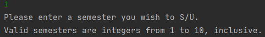

# User Guide for PlanNus

PlanNUS is a __desktop application for planning academic journey__ with modules offered by National University of Singapore (NUS). The __Command Line Interface (CLI)__ will be required for the program to work.

* Table of Contents
{:toc}

## Quick Start

1. Ensure that you have Java 11 or above installed.
1. Download the latest version of `PlanNUS` from [here](https://github.com/AY2021S1-CS2113T-F12-1/tp/releases).
1. Double click on _PlanNUS.jar_ to start up the program.
1. If the previous step does not work, open up the command prompt.
1. Go to the directory where the jar file is saved at.
1. Enter the following command `java -jar PlanNus.jar`

## Features 

PlanNUS has two separate commands at the main page where the users can either choose to have an outlook of their potential academic journey or calculate their CAP. For each of these commands, there are more specific functions for configuration of user's desired choices.

### Academic Calendar Planner: `acadplan`
Directs user to the page where he/she can plan a personalized academic journey in NUS by using `add`, `remove` , `view` or `edit` features as shown below.

Input format: `acadplan`

#### Adding a module into the calendar: `add`

Input format: `add <module code>`

**Example of proper usage:**

* `add CS2113T`
* `ADD cs2101`

Upon entering the desired module, user will be prompted to enter the semester when this module had been or to be taken before keying in the grade as shown in the image below.

__<ins>Caution</ins>:__ 

* Invalid module codes (i.e. Modules not offered by NUS) cannot be added into the calendar
* Duplicate module codes cannot be added into the calendar as well

#### Removing an existing module in the calendar: `remove`

Input format: `remove <module code>`

Example of usage:

* `remove cs2113T`
* `REMOVE CS2101`

__<ins>Caution:</ins>__ 

* Only modules that have been added into the calendar can be removed

#### Editing an existing module in the calendar: `edit`

Input format: `edit <module code>`

Example of usage:

* `edit CS2113T`
* `EDIT cs2101`

As shown in the image, user can choose to edit either the _Semester_ or _Grade_ of the selected module. (__Note:__ Enter either `1` or `2` instead of the component's name)

Expected output when user wishes to change the _Semester_.

Expected output when user wishes to change the _Grade_.

__<ins>Caution:</ins>__ 

* Only modules that have been added into the calendar can be edited

#### Printing the academic calendar: `view`

Input format: `view`

As shown in the image, users can choose from printing the full calendar by typing `full` or printing a specific semester by typing a number from 1-10, inclusive.

Expected output when user wishes to print the `full` calendar:

Expected output when user wishes to print a specific semester:

#### Printing help for academic calendar: `help`

Input format: `help`

### Cap Calculator: `capcalc`

Directs user to the page where he/she can view the `current` CAP or even `set target` CAP to be met in the upcoming semester(s). 

Input format: `capcalc`

#### Printing current CAP and MCs taken: `current`

The value of CAP depends entirely on the modules and with corresponding grades added by the user in Academic Calendar Planner.

Input format: `current`

__<ins>Caution:</ins>__

* If there are no modules added, the current CAP and graded MCs are set to 0

#### Set target CAP: `set target`

This is for the user to set a target CAP that he or she wishes to obtain for the next specified graded MCs.

Input format: `set target`

__<ins>Caution:</ins>__

* CAP should be between 0.00 to 5.00 inclusive.
* Minimum MC should be greater than 0.

#### Set S/U modules: `set su`

This is for the user to set modules that he or she wishes to S/U.

As shown in the image, user can choose to S/U by either a _Semester_ or some selected _Modules_. (__Note:__ Enter either `1` or `2` instead of the component's name)

Expected output when user wishes to S/U by _Semester_.

Expected output when user wishes to S/U by _Modules_.

User will then be prompte to enter a specific number of modules to  

__<ins>Caution:</ins>__ 

* Only modules that have been added into the calendar can be edited.
* Duplicate modules are not allowed.
* Number of modules to be S/Ued should not be greater than number of modules taken by the user.

### Exiting from a feature or PlanNUS: `exit`

This command directs user back to the main page of PlanNUS after they are done using a feature or exits from the entire application itself.

When user exits from the Academic Planner, expected output is as shown below.

When user exits from the CAP calculator, expected output will be as follows:

Last but not least, the expected output for exiting PlanNUS will be as such:

Input format: `exit`

## FAQ

Question Type|Question|Answer
:---:|---|---
General | How do I check which modules are offered by NUS? | For more info on which modules are offered by NUS, visit [here](https://nusmods.com/modules?sem[0]=1&sem[1]=2&sem[2]=3&sem[3]=4 "NUSMODS").
General | What is a valid semester index? | For the purpose of this planning software, we have come to a decision to limit the maximum number of semesters an undergraduate can take to 10, which is 5 academic years. The notation they are represented by is by an integer of value 1 to 10. For a fresh undergraduate, they will begin at semester index of 1. For a year 3 student who is currently in semester 1, the semester index will be 5. Please refer to the appendix for more information.
General | What is a valid grade? | **Letter Grades**: A+, A, B+, B, B-, C+, C, D+, D, F , **Special Grades**: CS, CU, S, U, W, IC, IP, AUD, WU, EXE, **If you have yet to have a grade for the module**: NT
General | What is the name of the saved file? | The name of the saved file is `PlanNUS.txt` and can be found at the base of the folder, in the same location as your PlanNUS.jar.

## Command Summary

Note that the following commands are case-insensitive.

* Initiate the __Academic Calendar Planner__: `acadPlan`

| __Action__                                  | Command                |
| ------------------------------------------- | ---------------------- |
| Adding a module into the calendar           | `add <module code>`    |
| Removing an existing module in the calendar | `remove <module code>` |
| Editing an existing module in the calendar  | `edit <module code>`   |
| Printing the academic calendar              | `view`                 |
| Printing help information                   | `help`                 |
| Exiting the Academic Planner                    | `exit`                 |

* Initiate the __CAP calculator__: `capCalc`

| __Action__                           | __Command__   |
| ------------------------------------ | ------------- |
| Printing current CAP and MCs taken   | `current`     |
| Configure current CAP and graded MCs | `set current` |
| Set target CAP                       | `set target`  |
| Make the module grade as S/U         | `set SU`      |
| Exiting the CAP Calculator           | `exit`        |

## Appendix

### Naming convention for semester indexes

For the purpose of this planning software, we have decided to limit the maximum number of semesters an undergraduate can take to 10, which is equivalent to 5 academic years. Each semester is indexed by an integer between 1 to 10. For a fresh undergraduate, they will begin at semester index of 1. For a year 3 student who is currently in semester 1, the semester index will be 5. Below is a table which illustrates the corresponding semester indexes for undergraduates.

| Academic Year | Semester (as of Academic Year) | Semester Index |
| :-----------: | :----------------------------: | :------------: |
|       1       |               1                |       1        |
|       1       |               2                |       2        |
|       2       |               1                |       3        |
|       2       |               2                |       4        |
|       3       |               1                |       5        |
|       3       |               2                |       6        |
|       4       |               1                |       7        |
|       4       |               2                |       8        |
|       5       |               1                |       9        |
|       5       |               2                |       10       |

### Grade values

As per NUS Grade Policy, letter grades will have a corresponding Academic Point attached to them. Special cases such as Satisfactory/Unsatisfactory (SU) grades can be captured by our software as well. Below is a table of grades and their corresponding grade value. Do note that the grades of forecasted modules should be declared as NT, short for Not Taken.

|            Grade            | Academic Points |
| :-------------------------: | :-------------: |
|             A+              |       5.0       |
|              A              |       5.0       |
|             A-              |       4.5       |
|             B+              |       4.0       |
|              B              |       3.5       |
|             B-              |       3.0       |
|             C+              |       2.5       |
|              C              |       2.0       |
|             D+              |       1.5       |
|              D              |       1.0       |
|              F              |       0.0       |
| Additional Grading Options* |        -        |

*Additional Grading options include S,U,CS,CU,IC,IP,AUD,EXE,W,WU. They hold no Academic Point Value.

