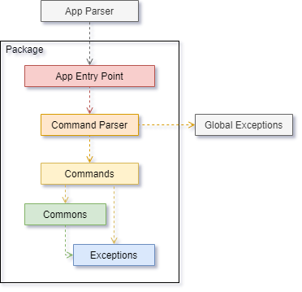

# Khenus Tan - Project Portfolio Page

## Overview

PlanNUS is a greenfield, CLI-based project which aims to solve the gap in undergraduate academic planning in NUS. With the Academic Calendar Planner, PlanNUS will be able to assist undergraduate students in forecasting their academic journey for their 4 or 5 years in NUS. With the CAP Calculator , PlanNUS will be able to tell you your current CAP and forecast future grades needed to achieve your target CAP.

### Summary of Contributions

* Code contributed: [Reposense Link](https://nus-cs2113-ay2021s1.github.io/tp-dashboard/#breakdown=true&search=khenus&sort=groupTitle&sortWithin=title&since=2020-09-27&timeframe=commit&mergegroup=&groupSelect=groupByRepos&checkedFileTypes=docs~functional-code~test-code~other "Link to contributed code")
* **New Feature:** Added the ability to navigate between different apps within PlanNUS.
    * What it does: Allow users to select between Academic Planner or CAP Calulator at any point while using PlanNus.
    * Justification: This feature allow users to fully utilise all other features offered by PlanNUS with great ease. It also serve as an entry point for **users** when using PlanNUS.
    * Highlights: This feature handles the flow of data within PlanNUS to provide users with the ability to toggle between apps seamlessly. It also ensures proper allocation and usage of memory space to prevent unexpected crashes due to memory leak.
* **New Functionality:** Created a JavaScript program to clean up all module information retrieve from NUSMODS API.
    * What it does: Removal of extra information and reformatting needed information to allow for ease of conversion from Javascript Object Notation (JSON) to Plain Old Java Object (POJO).
    * Justification: The creation of this program is to assist in removing irrelevant data and reformatting nested objects from all 12436 modules within the JSON file retrieved from NUSMODS API to improve both spatial and temporal efficiencies during the eventual conversion of JSON into POJO in PlanNUS.
    * Highlights: This program allows for the formatting of specific output fields, removal of irrelevant information from the final list, counting of total number of modules offered, finding the length of the longest module name, the minimum MC across all modules offered and searching of a specific module within the final list.
* **New Functionality:** Creation of `ModuleLoader` class
    * What it does: The `ModuleLoader` class allows for the creation of a POJO and HashMap from the formatted JSON file containing all NUS module information using GSON library from Google.
    * Justification: This class creates an ArrayList named `allModules` for fellow developers to access module information when needed.  It also creates a HashMap named `moduleMap` that stores the Module Code and the index of said module in `allModules`. This allows for efficient retrieval of module information from `allModules`.
    * Highlights: This implementation allows for near $o(1)$ access of the huge `allModules` array with 12436 entries, preventing PlanNUS from feeling sluggish. 
* **New Functionality:** Creation of `AppParser` class
    * What it does: The `AppParser` class parses user input and starts the correct application for users. `AppParser` also handles the passing of user data between different application. 
    * Justification:  This class is created to allow for new applications to be added into PlanNUS easily. It also allows for formatting of user input before it is verified against the list of known command and acts as a centralised entry point for their individual applications.
* **New Functionality:** Creation of `Ui` class
    * What it does: This class acts as an interface between the user and PlanNUS. It is also responsible to initialising a single `Scanner` class to be shared across the whole of PlanNUS.
    * Justification:  A unified `Scanner` class is needed to prevent multiple unclosed streams from causing unexpected `EOF` errors. 
* **New Functionality:**  Creation of `CalculatorUtils` class
    * What it does: This class updates user's CAP after each module operation such as `add`, `edit` and `remove`
    * Justification: This calculation is needed after each operation to ensure that the current CAP of the user is updated. It also prevents miscalculation of CAP due to Special Grades such as SU.
    * Highlights: These operations improves overall efficiency of CAP Calculator as these operation execute within $o(1)$ time and allows `current` command in CAP Calculator to be $o(1)$.
* **New Functionality:** Creation of `FieldValidator` class
    * What it does: `FieldValidator` is responsible for ensuring that each entry from the save file is valid. It also gives information regarding which specific field within that entry is corrupted.
    * Justification: This class is needed to ensure that corrupted entries within the save file can be handled by PlanNUS gracefully.
* **New Functionality:** Creation of `App`, `Command`, and `FullModule` classes in `global` folder
    * What it does: These classes are essential as it forms the parent class for every App and Command within PlanNUS. The `FullModule` class is responsible for storing information of each module after being converted into POJO by GSON.
    * Justification: These classes are created to ensure that every App and Command within PlanNUS follows a certain format to allow for ease of adaptation into `main`.
* **Documentation**
    * User Guide
        * Took and formatted all images [#159](https://github.com/AY2021S1-CS2113T-F12-1/tp/pull/159)
        * Proofreading of User Guide
    * Developer Guide
        * Added documentation for Architecture, Overview: PlanNUS, Project Structure and Lifecycle of PlanNUS [#105](https://github.com/AY2021S1-CS2113T-F12-1/tp/pull/105), [#141](https://github.com/AY2021S1-CS2113T-F12-1/tp/pull/141), [#142](https://github.com/AY2021S1-CS2113T-F12-1/tp/pull/142), [#143](https://github.com/AY2021S1-CS2113T-F12-1/tp/pull/143), [#144](https://github.com/AY2021S1-CS2113T-F12-1/tp/pull/144), [#145](https://github.com/AY2021S1-CS2113T-F12-1/tp/pull/145)
        * Proofreading of Developer Guide

* **Team-Based Tasks**
  * Reviewing and accepting most pull requests.
  * Setting up Gradle with extra dependencies, namely Apache Commons and GSON. [#2](https://github.com/AY2021S1-CS2113T-F12-1/tp/pull/2)
  * Made code quality enhancements [#34](https://github.com/AY2021S1-CS2113T-F12-1/tp/pull/34), [#98](https://github.com/AY2021S1-CS2113T-F12-1/tp/pull/98)
  * Created templates for standardisation of coding format across PlanNUS [#42](https://github.com/AY2021S1-CS2113T-F12-1/tp/pull/42), [#53](https://github.com/AY2021S1-CS2113T-F12-1/tp/pull/53)
  * Efficiency improvements across PlanNUS [#85](https://github.com/AY2021S1-CS2113T-F12-1/tp/pull/85)
  * General Bug Fixes [#33](https://github.com/AY2021S1-CS2113T-F12-1/tp/pull/33), [#117](https://github.com/AY2021S1-CS2113T-F12-1/tp/pull/117)
  * Release Management ([V2.0](https://github.com/AY2021S1-CS2113T-F12-1/tp/releases/tag/V2.0))

* ***Note that the Contributions for User Guide cannot be extracted as it spans the whole document***

* **Contributions to the Developer Guide (Extract)** 

  * ## 3. Design

    ### 3.1. Architecture

    

        
    

    The ***Architecture Diagram*** given above explains the high-level design of PlanNUS. Below is a quick overview of each component.

     

    ### 3.2. Overview

    #### 3.2.1. PlanNus

    `PlanNus` class contains the `main` and `run` method, which is responsible for

      * At launch

        * Loading all modules for AY2020/21 into PlanNUS

        * Loading previous save file into PlanNUS if available

        * Creation of entry point to available apps in PlanNUS

      * While running

        * Continuously prompt user for app selection

      * At shut down

        * Saving of user data into save file
        * Clean up methods where necessary

     

    #### 3.2.2. Global, Ui, Parser, Storage, Apps

    * The `global` package contains classes, exceptions and objects that are required across the whole app. 
    * The `ui` package contains the class that is responsible for sharing one `scanner` class across the whole app to prevent multiple IO streams
    * The `parser` package contains the class that handles user's app selection
    * The `storage` package handles loading and saving of user's data to a save file.
    * Packages for Available apps such as Academic Planner and CAP Calculator are stored within `apps` package

     

    ### 3.3. Project Structure

    Each package in the PlanNUS as given above follows the following file structure where applicable:

    * A functional class that acts as the entry point to that module
    * A parser class that parses user input into executable commands by PlanNUS

    * `commands`: A package that handles all executable commands given by parser
    * `commons`: A package with the utilities and shared classes across the parent package
    * `exceptions`: A package to handle all exceptions thrown across the parent package

    The interaction within each package should ideally be as shown below.

    

        
    

    *Note that while this is the ideal case, packages such as* `global`, `parser` *and* `ui` *might not strictly follow this structure due to these package serving a different function altogether (Refer to the sections below for more details.)*

     

    ### 3.4. Life cycle of PlanNUS

    The [*sequence diagram*](#sequence-diagram) below shows how different packages and classes interact with each other throughout the whole [life cycle](#life-cycle) of PlanNUS.

    

        
    

     