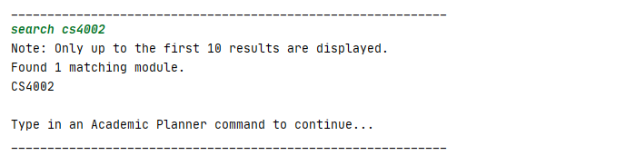

## Vanessa Kang - Project Portfolio Page

## Project: PlanNUS

PlanNUS is a greenfield, CLI-based project which aims to solve the gap in undergraduate academic planning in NUS. PlanNUS removes the need for Excel sheets and CAP calculator websites by bundling their functionalities, and more, into two key apps: the _Academic Planner_ and _CAP Calculator_.

The _Academic Planner_ assists students in planning out their academic calendar for the entire duration (4-5 years) of their NUS candidature. It provides students with a convenient interface to keep track of the modules that they have taken, or are planning to take, along with the associated semester and grade information. 

The _CAP Calculator_ then makes use of this existing data to calculate students' current CAP. This helps students to accurately monitor, and even forecast, their academic performance.

Given below are my contributions to the project.

- **Code contributed:** [RepoSense Link](https://nus-cs2113-ay2021s1.github.io/tp-dashboard/#breakdown=true&search=vanessa&sort=groupTitle&sortWithin=title&since=2020-09-27&timeframe=commit&mergegroup=&groupSelect=groupByRepos&checkedFileTypes=docs~functional-code~test-code~other&tabOpen=true&tabType=authorship&zFR=false&tabAuthor=vanessa-kang&tabRepo=AY2021S1-CS2113T-F12-1%2Ftp%5Bmaster%5D&authorshipIsMergeGroup=false&authorshipFileTypes=docs~functional-code~test-code~other)
- **New Feature:** Added the ability to view all modules in the user's academic calendar.
  - What it does: Allows users to view all the modules - together with their associated grades, and sorted by semester - that are currently in their academic calendar.
  - Justification: This feature gives users a clear overview of all the modules that they have taken (or plan to take), which will aid users greatly when planning their academic journey.
- **New Feature:** Added the ability to view the details of a specific module.
  
  - What it does: Allows users to view detailed information about a specific module, such as semesters offered, prerequisites, and preclusions.
  
  - Justification: Users who need to quickly look up crucial information about specific modules can do so within PlanNUS itself, eliminating the need to toggle between PlanNUS and an external search window.
  
  - Highlights: While formatting the module information for printing, two things needed to be taken into consideration: 
  
    1. What information do students actually find useful? And
    2. How to lay out these details in a clear, unambiguous manner?
  
    Otherwise, this feature would potentially cause students even more confused than before.
- **New Feature:** Added the ability to search for modules that contain a specific keyword.
  - What it does: Allows users to input a keyword, then searches the module database for modules that contain this keyword. Currently, it only searches based on module code, and displays only the first 10 results.
  - Justification: If users are unsure of the full code of a certain module, this feature would be a handy tool to jog their memory.
  
- **Documentation:**
  - User Guide:
    - Added documentation for `details` and `search` ([#132](https://github.com/AY2021S1-CS2113T-F12-1/tp/pull/132))
    - Formatting and proofreading of User Guide ([#132](https://github.com/AY2021S1-CS2113T-F12-1/tp/pull/132), [#241](https://github.com/AY2021S1-CS2113T-F12-1/tp/pull/241), [#242](https://github.com/AY2021S1-CS2113T-F12-1/tp/pull/242), [#305](https://github.com/AY2021S1-CS2113T-F12-1/tp/pull/305), [#312](https://github.com/AY2021S1-CS2113T-F12-1/tp/pull/312))
  - Developer Guide:
    - Added documentation for `ModuleDetailsCommand` ([#173](https://github.com/AY2021S1-CS2113T-F12-1/tp/pull/173))
    - Added use cases for _Academic Planner_ features ([#236](https://github.com/AY2021S1-CS2113T-F12-1/tp/pull/236))
    - Added instructions for manual testing ([#245](https://github.com/AY2021S1-CS2113T-F12-1/tp/pull/245), [#289](https://github.com/AY2021S1-CS2113T-F12-1/tp/pull/289))
    - Formatting and proofreading of Developer Guide ([#242](https://github.com/AY2021S1-CS2113T-F12-1/tp/pull/242), [#312](https://github.com/AY2021S1-CS2113T-F12-1/tp/pull/312))
- **Team-based tasks:**
  
  - General bug fixes ([#238](https://github.com/AY2021S1-CS2113T-F12-1/tp/pull/238))
  - Alerted teammates to bugs that needed fixing (e.g. [#103](https://github.com/AY2021S1-CS2113T-F12-1/tp/pull/103), [#288](https://github.com/AY2021S1-CS2113T-F12-1/tp/pull/288), [#307](https://github.com/AY2021S1-CS2113T-F12-1/tp/issues/307))
- **Review contributions:**
  
  - PRs reviewed (with non-trivial review comments): 
    - iP: [#15](https://github.com/nus-cs2113-AY2021S1/ip/pull/15), [#154](https://github.com/nus-cs2113-AY2021S1/ip/pull/154)
    - tP: [#26](https://github.com/nus-cs2113-AY2021S1/tp/pull/26), [#68](https://github.com/nus-cs2113-AY2021S1/tp/pull/68), [PE dry run](https://github.com/vanessa-kang/ped/issues)

- **Contributions to the User Guide (Extracts):**

  #### 6.1.4. Viewing the details of a module: `details`

  <!-- @@author vanessa-kang -->

  This command is for you to view the detailed information of a particular module.

  Input format: `details <module code>`

  Example of usage:

  - `details CS2101`
  - `DETAILS cs2113t`

  <table><tr><td>

      
  
</td></tr></table>

  As shown in the image, you can input the module that they wish to view further details about.

  __<ins>Caution:</ins>__ 

  - No information will be printed if the module is not offered by NUS.

   

  #### 6.1.5. Searching for module codes containing a keyword: `search`

  This command is for when you are unsure of the full module code.

  Input format: `search <module code key>`

  Example of usage:

  - `search CS21`
  - `SEARCH cg4002`

  <table><tr><td>

      
  
</td></tr></table>

  <table><tr><td>

      
  
</td></tr></table>

  As shown above, you can enter a search key that contains either part of, or the whole module code.

  __<ins>Caution:</ins>__ 

  - This feature currently only supports searching by module code.
  - Only up to the first 10 results are displayed.  

- **Contributions to the Developer Guide (Extracts):**

  ### 4.4. Academic Calendar Planner: View Module Details Feature

  <!-- @@author vanessa-kang -->

  #### 4.4.1. Current implementation

  View module details command is executed by `AcademicPlannerParser`. It allows the user to view the full details of any module offered by NUS, by accessing the specified `FullModule` object that corresponds to the module code entered by the user, and printing its attributes.

  Additionally, the view module details command extends the `Command` class and overrides its `execute()` command. An external class, `ModuleValidator` is called upon to validate the module code that the user has entered, as only the details of valid NUS modules can be displayed.

  Given below is an example usage scenario and how view module command behaves at each step.

  

      
  

  __Step 1:__ The user calls the view module details command from the `AcademicPlannerParser`, which will initialise a `ModuleDetailsCommand`. `ModuleDetailsCommand`'s constructor takes in parameters of  `ModuleLoader` and `String`. Below is a table of what each parameter corresponds to in the state diagram of the program.

| Parameter (Class Name) |        Corresponds to (Function of Class)         | Referred to as (Variable Name) |
| :-------------------------: | :----------------------------------------------------: | :---------------------------------: |
|       `ModuleLoader`        |     Class representing all modules offered by NUS      |            `allModules`             |
|          `String`           | Class representing the module code to print details of |            `moduleCode`             |

__Step 2:__ `execute()` is called from the instance of `ModuleDetailsCommand`. It can throw `AcademicException`.

__Step 3:__ `validateModuleCode()` is called to validate the user input, `moduleCode`, against `allModules`.

__Step 4:__ `PrintUtils` is called to print the details of the module.

    

__Step 5:__ `ModuleDetailsCommand`, `ModuleLoader` and `PrintUtils` are terminated.

The following sequence diagram shows how `ModuleDetailsCommand` works.

    

The following diagram summarizes what happens when the user executes a `ModuleDetailsCommand`: 

    

